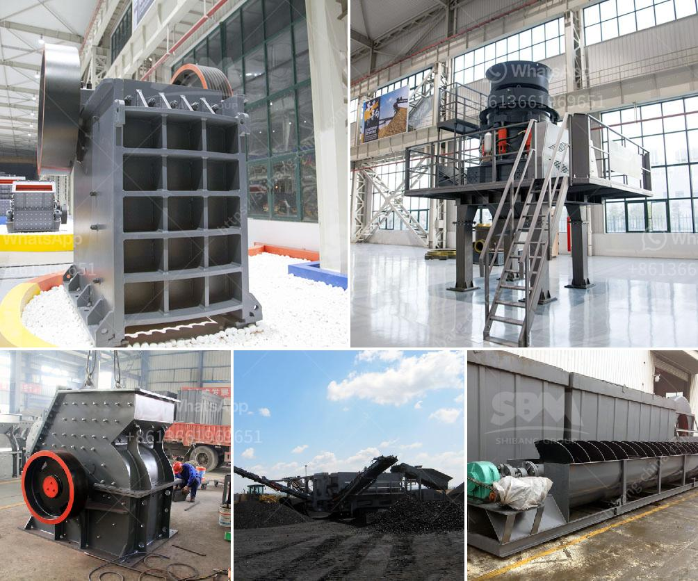

<h3>pulverizer springs problems</h3>
Pulverizer springs play a crucial role in the operation of pulverizers, commonly used in industries such as mining, construction, and power generation. These springs help absorb shocks, reduce vibrations, and maintain stability during the grinding process. However, like any mechanical component, pulverizer springs can face various problems that can hinder their performance and put the entire system at risk. In this article, we will discuss some common issues faced by pulverizer springs and the possible solutions to overcome them.

One of the most prevalent problems with pulverizer springs is fatigue failure. Over time, as the springs undergo repeated stress cycles, they may develop cracks or even break. Fatigue failure is often a result of excessive pressure, improper maintenance, or using low-quality springs. Regular inspection and timely replacement of worn-out springs can significantly reduce the risk of fatigue failure.

Another problem faced by pulverizer springs is sagging or loss of tension. Springs that have lost their original tautness can cause the pulverizer to vibrate excessively, leading to reduced efficiency and increased wear and tear on other components. Sagging can occur due to extended use, changes in ambient temperature, or spring demagnetization. Replacing sagging springs or adjusting their tension can restore the proper functioning of the pulverizer.

Spring misalignment is also a common issue that can affect pulverizer performance. Misalignment occurs when the springs are not correctly positioned or are not equidistant from the vertical axis. This can lead to increased vibrations, uneven distribution of pressure, and even damage to the pulverizing system. Proper installation and precise alignment of the springs can help resolve this problem.

Additionally, inadequate lubrication can cause significant issues with pulverizer springs. Insufficient or improper lubrication can lead to increased friction, wear, and corrosion, reducing the lifespan of the springs. Regular lubrication maintenance, using appropriate lubricants, and adhering to the manufacturer's recommendations can prevent such problems and ensure smooth operation.

Furthermore, another problem that can arise is spring resonance. When the frequency of external forces matches the natural frequency of the spring, resonance can occur. This can result in excessive vibration and ultimately lead to the failure of not only the springs but also other components of the pulverizer. Analyzing the natural frequency and adjusting operational parameters, such as rotational speed and feed rate, can help avoid resonance-related issues.

In conclusion, pulverizer springs are critical components in pulverizing systems, assisting in maintaining stability and reducing vibrations. However, they are susceptible to several problems, including fatigue failure, sagging, misalignment, inadequate lubrication, and spring resonance. Timely detection and appropriate solutions to these issues are crucial to prevent further damage and ensure the smooth functioning of the pulverizer. Regular inspection, following manufacturer guidelines, and implementing proactive maintenance strategies can significantly enhance the lifespan and efficiency of pulverizer springs, leading to optimum performance in various industrial applications.
<h3>Contact us</h3><ul><li><strong>Whatsapp:&nbsp;<a href="https://wa.me/8613661969651">+8613661969651</a></strong></li><li><a href="https://swt.shibang-china.com/?git&amp;zhl&amp;pulverizer springs problems"><strong>Online Service(chat now)</strong></a></li></ul><h3>Related</h3><ul><li><a href='small scale mining equipment in nigeria.md'>small scale mining equipment in nigeria</a></li><li><a href='open cast mining china clay process.md'>open cast mining china clay process</a></li><li><a href='diamond mining equipment and pictures.md'>diamond mining equipment and pictures</a></li><li><a href='different size mining cone crusher.md'>different size mining cone crusher</a></li><li><a href='mining hammer crusher.md'>mining hammer crusher</a></li></ul>