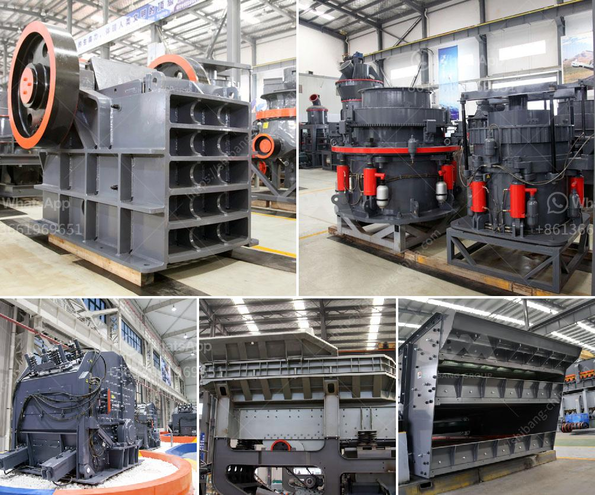

<h3>purchase of stone crusher</h3>
Stone crushing industry is an important industrial sector in the country engaged in producing crushed stone of various sizes depending upon the requirement which acts as raw material for various construction activities such as construction of roads, highways, bridges, buildings, canals etc. It is estimated that there are over 12,000 stone crusher units in India. The number is expected to grow further keeping in view the future plans for development of infrastructure of roads, canals and buildings that are required for overall development of the country.

In India, the Stone Crushing Industry sector is estimated to have an annual turnover of Rs. 5000 crore (equivalent to over US$ 1 billion) and is therefore an economically important sector. The sector is estimated to be providing direct employment to over 500,000 people engaged in various activities such as mining, crushing plant, transportation of mined stones and crushed products etc.

There are various kinds of crushers used depending on the materials that need to be crushed. Jaw crusher is an important mechanical equipment for the crushing unit. Generally, the small stone crushing plants having only one jaw crusher used as primary or secondary crusher along with one or maximum 2 screening machines are grouped as small stone crushers.

Medium-sized stone crusher is one of the leading products of the company, especially in the design and production of large crusher mill at the absolute leading level at home and abroad. If you need any help of stone crusher 250-3000 tph usual, please contact us directly.

In addition to stone crushers, we have equipment for vertical shaft impactor (VSI), HSI, Roller Shell, Casting as per customer requirements. We also have equipment for pollution control, feeders, and screens, sand plant and conveyors.

These products are sold in various specifications, and having a performance-oriented design are cheap to run and maintain. These products are used in industries such as quarrying, mining, landfill, cement production, waste management, and demolition.

Purchasing a stone crusher is a big decision that should not be taken lightly. In order to make an informed choice, you need to understand a lot of important information beforehand, such as the characteristics of the crusher, the power supply requirements, the size and hardness of the rock, the expected capacity, etc. Only by knowing all these information can you choose a suitable crusher for your project.

In addition, you should also consider the manufacturer's reputation, service, price, and whether there are any after-sales services when purchasing a stone crusher. A good manufacturer will provide professional technical support and after-sales service, and the price is also in proportion to the quality of the product.

In conclusion, the purchase of a stone crusher is a comprehensive project, which needs to be considered from every aspect. In addition to the quality of the equipment, customers should also consider the price and service of the product. After all, the price of a good quality stone crusher is not cheap.
<h3>Contact us</h3><ul><li><strong>Whatsapp:&nbsp;<a href="https://wa.me/8613661969651">+8613661969651</a></strong></li><li><a href="https://swt.shibang-china.com/?git&amp;zhl&amp;purchase of stone crusher"><strong>Online Service(chat now)</strong></a></li></ul><h3>Related</h3><ul><li><a href='bauxite ore business plan pdf.md'>bauxite ore business plan pdf</a></li><li><a href='mining process of calcium carbonate in south africa.md'>mining process of calcium carbonate in south africa</a></li><li><a href='ball mill micron.md'>ball mill micron</a></li><li><a href='stone crusher manufacturers in ludhiana.md'>stone crusher manufacturers in ludhiana</a></li><li><a href='stone crusher plant manufacturers china.md'>stone crusher plant manufacturers china</a></li></ul>