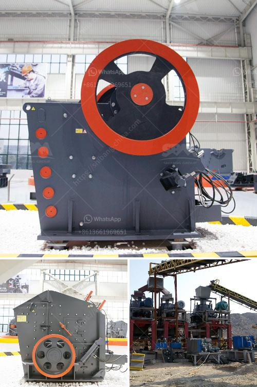

<h3>puzzolana 100tph cone crusher plant price</h3>
Puzzolana is one of the renowned manufacturers of crushing and screening plants. They have recently released a 100-120 tph cone crusher plant price. The price of this machine is quite affordable and the delivery time is also quick.

Puzzolana has designed this machine with utmost care and precision. It is highly reliable and offers excellent crushing capabilities. This cone crusher plant can crush a wide range of ores and rocks, including iron ore, limestone, granite, basalt, river pebbles, and so on.

The main features of this machine include a robust design, easy maintenance, and high productivity. It has a sturdy frame made from high-quality steel that can withstand heavy loads and extreme conditions. The cone crusher is equipped with a hydraulic system that allows for easy adjustment of the crusher settings to achieve the desired product size.

The Puzzolana cone crusher plant is driven by a power transmission system composed of a belt drive and a grooved pulley. It is equipped with a reliable and efficient motor to ensure continuous and smooth operation of the machine. The machine is also equipped with an automatic lubrication system that ensures proper lubrication of the moving parts.

The cone crusher plant is equipped with a vibrating feeder that ensures a consistent and efficient feeding of the raw materials into the crusher. The feed opening of the machine is 240mm x 1300mm, which can accommodate a variety of rock sizes.

One of the main advantages of the Puzzolana cone crusher plant is its versatility. It can be used for a wide range of applications, such as primary crushing, secondary crushing, and final product screening. The machine can produce high-quality aggregates for construction purposes, as well as fine and coarse sand for various industrial applications.

The 100-120 tph cone crusher plant is available in two different options: stationary and mobile. Both options offer the same great features and performance, but the mobile option allows for mobility and flexibility, making it easier to transport and set up at different job sites.

In conclusion, the Puzzolana 100-120 tph cone crusher plant price is affordable, versatile, and reliable, making it an ideal choice for crushing and screening applications. It can crush a wide range of materials and produce high-quality aggregates. The machine is easy to maintain and operate, ensuring maximum productivity and efficiency. Whether for construction purposes or industrial applications, this cone crusher plant is a valuable investment.
<h3>Contact us</h3><ul><li><strong>Whatsapp:&nbsp;<a href="https://wa.me/8613661969651">+8613661969651</a></strong></li><li><a href="https://swt.shibang-china.com/?git&amp;zhl&amp;puzzolana 100tph cone crusher plant price"><strong>Online Service(chat now)</strong></a></li></ul><h3>Related</h3><ul><li><a href='hydraulic conveyor belts.md'>hydraulic conveyor belts</a></li><li><a href='roller mill manufacturers in nigeria.md'>roller mill manufacturers in nigeria</a></li><li><a href='cement clinker crushing plant.md'>cement clinker crushing plant</a></li><li><a href='quarry crusher with 60 tph.md'>quarry crusher with 60 tph</a></li><li><a href='two pass roller mill.md'>two pass roller mill</a></li></ul>