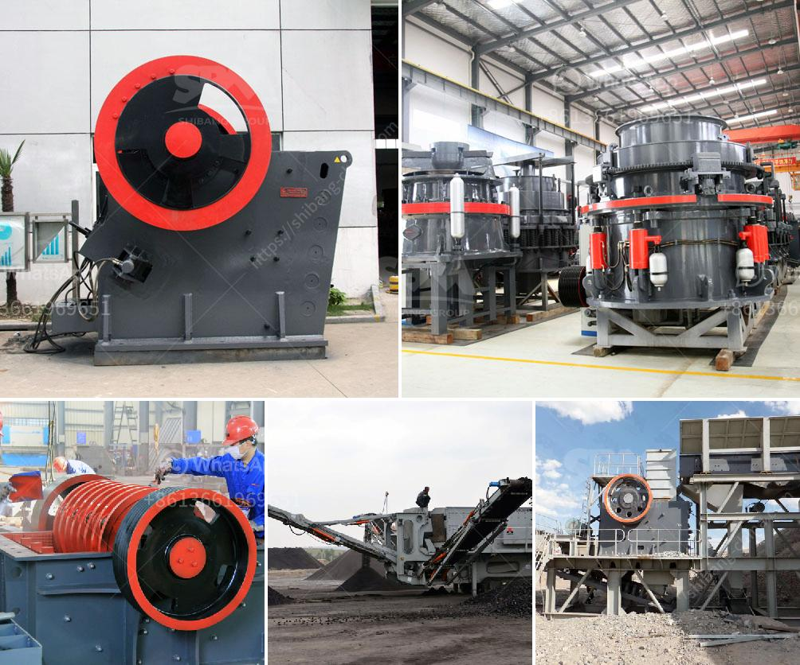

<h3>puzzolana 50 tph crusher plant prices</h3>
Puzzolana is a supplier of high-quality crushing plants that offer reliable and efficient solutions for crushing stones and minerals. Based on the requirements laid down by their customers, Puzzolana produces a variety of plants and equipment including mobile crusher plants, crawler cranes, dumpers, and loaders. To assist their customers in choosing the right equipment, Puzzolana provides their expertise through their technical support team.

One of the popular equipment that Puzzolana offers is the 50 tph crusher plant. This plant is typically used for crushing rocks and stones. The equipment is designed with advanced technology and comes with a sturdy structure, which indicates its durability. It also features a high production capacity, making it suitable for both large-scale and small-scale projects.

The 50 tph crusher plant prices are not prohibitively expensive. This makes it attainable for everyone. To know the prices of this plant and other products, customers have the option to visit their website and contact them directly. Alternatively, one can also reach out to their sales team for a detailed quote. By doing so, customers can get a clear idea of the total investment required for their project.

Puzzolana's 50 tph crusher plants are ideally suited for producing sand, aggregates (gravel), and stones for construction purposes. This plant consists of a series of machines designed for efficient crushing and screening of rocks and minerals into different sizes. Depending on the project requirements, the plant can be configured with different crushing and screening equipment.

The advantage of choosing Puzzolana's 50 tph crusher plant is its high efficiency and reliable performance. The machine is highly productive and requires minimal maintenance. Its cutting-edge technology ensures that the plant operates with reduced noise levels and fulfills the environmental norms. Additionally, the plant is user-friendly, which means that operators can easily operate and maintain it.

With Puzzolana's 50 tph crusher plant, the performance of the machine is always at its best. The company ensures that the quality of their products exceeds their customers' expectations. Their proficient technical support team also assists customers throughout the equipment's lifecycle. From installation to commissioning, Puzzolana is committed to providing robust solutions that meet the requirements of the ever-evolving construction industry.

In conclusion, Puzzolana's 50 tph crusher plant prices are not only pocket-friendly but also ensure high efficiency and reliable performance. The machine is specifically designed for crushing stones and minerals efficiently and effectively. The 50 tph crusher plant can be widely used in both small-scale and large-scale industries for stone crushing purposes. This equipment is available in various configurations to meet the diverse needs of customers, rendering it highly versatile and adaptable. With Puzzolana's expertise and commitment to excellence, customers can undoubtedly rely on the 50 tph crusher plant to provide incredible value for their investment.
<h3>Contact us</h3><ul><li><strong>Whatsapp:&nbsp;<a href="https://wa.me/8613661969651">+8613661969651</a></strong></li><li><a href="https://swt.shibang-china.com/?git&amp;zhl&amp;puzzolana 50 tph crusher plant prices"><strong>Online Service(chat now)</strong></a></li></ul><h3>Related</h3><ul><li><a href='calcite processing plant.md'>calcite processing plant</a></li><li><a href='stone crusher sale in peru.md'>stone crusher sale in peru</a></li><li><a href='rental crusher vertical.md'>rental crusher vertical</a></li><li><a href='stone crusher in goa.md'>stone crusher in goa</a></li><li><a href='cone crusher 100tph prices in india.md'>cone crusher 100tph prices in india</a></li></ul>