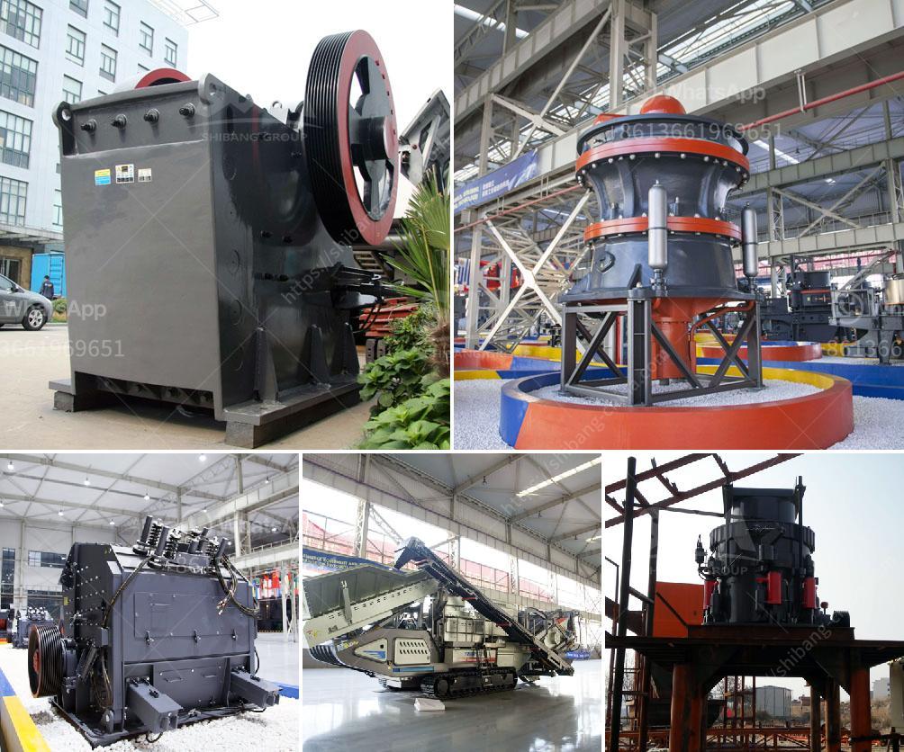

<h3>puzzolana crusher tonnes per hour</h3>
Puzzolana, a renowned name in the crushing industry, has been delivering top-notch crushers for over five decades. The company has an unmatched reputation for delivering high-quality and efficient crushers that can handle a wide range of materials. With their advanced technology and commitment to customer satisfaction, Puzzolana crushers have become the trusted choice for many industries.

One of the key features of Puzzolana crushers is their exceptional production capacity. The company offers various models, including jaw crushers, cone crushers, and vertical shaft impactors, that can process a significant amount of material in a single pass. One of their popular models is the Puzzolana 50 to 400 tonne per hour crusher, which is available in two configurations - stationary and mobile.

The stationary crushers are designed to be mounted on a fixed foundation and are ideal for large-scale operations. These crushers can process tonnes of material per hour, making them perfect for mines, ore processing plants, and other heavy-duty applications. The robust design and high-quality components ensure reliable and trouble-free operation even under challenging conditions.

On the other hand, the mobile crushers are designed for easy transportation and can be quickly set up at different job sites. These crushers are perfect for contractors who need to move their equipment frequently. The Puzzolana mobile crushers have all the features of their stationary counterparts, including high production capacity, efficient performance, and low maintenance requirements.

One of the key factors behind Puzzolana's success is their focus on innovation and technology. The company invests heavily in research and development to continuously improve their products. They have collaborated with international experts to incorporate the latest advancements in crushing technology into their crushers. As a result, Puzzolana crushers offer superior performance, energy efficiency, and reduced operating costs.

In addition to their crusher models, Puzzolana also provides a complete range of auxiliary equipment to complement their crushers. This includes feeders, screens, conveyors, and washing systems, which are designed to work seamlessly with the crushers and enhance their overall efficiency.

Puzzolana also emphasizes on after-sales service to ensure customer satisfaction. They have a dedicated team of service engineers who are available round the clock to assist customers with installation, maintenance, and repairs. This commitment to customer support has earned them a loyal customer base and repeat business.

In conclusion, Puzzolana crushers are a trusted name in the crushing industry, known for their exceptional production capacity and reliable performance. Whether it is a stationary or a mobile crusher, Puzzolana offers a wide range of options to suit different requirements. With their focus on innovation, advanced technology, and customer satisfaction, Puzzolana continues to lead the way in the crushing industry.
<h3>Contact us</h3><ul><li><strong>Whatsapp:&nbsp;<a href="https://wa.me/8613661969651">+8613661969651</a></strong></li><li><a href="https://swt.shibang-china.com/?git&amp;zhl&amp;puzzolana crusher tonnes per hour"><strong>Online Service(chat now)</strong></a></li></ul><h3>Related</h3><ul><li><a href='track mounted mobile crusher plant.md'>track mounted mobile crusher plant</a></li><li><a href='egypt crusher suppliers manufacturers.md'>egypt crusher suppliers manufacturers</a></li><li><a href='roller screen for coal.md'>roller screen for coal</a></li><li><a href='rock crasher for sale philippines.md'>rock crasher for sale philippines</a></li><li><a href='dolomite crusher manufacture plant.md'>dolomite crusher manufacture plant</a></li></ul>