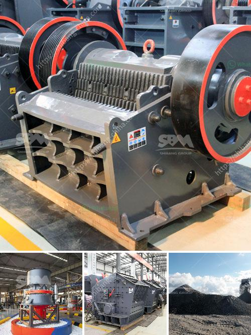

<h3>puzzolana tph cone crusher plant prices</h3>
Puzzolana is one of the undeniably famous brands in the world of crushing and screening equipment. Its extensive range of cone crushers for primary, secondary, and tertiary crushing is highly popular in the market. Puzzolana is known for producing efficient and reliable cone crushers that fit various crushing applications.

When it comes to the prices of Puzzolana's 200 tph cone crushers, they range from $40,000 to $50,000. It's worth mentioning that these prices are indicative and may vary depending on factors such as the location of purchase, currency exchange rates, and import duties. However, despite the potential variation in prices, Puzzolana cone crushers are considered cost-effective solutions for crushing various ores and rocks.

Puzzolana's cone crusher plants are highly mobile to facilitate easy transportation. They come with cutting-edge technology that ensures efficient and reliable performance. The cone crushers are designed to optimize crushing processes and reduce operational costs. Additionally, the sturdy construction and high-quality materials used in manufacturing these crushers enhance their reliability and durability.

These cone crushers are available in different configurations and models, including the popular 200 tph cone crusher plant. With its outstanding crushing capacity, smooth operation, and innovative design, the Puzzolana 200 tph cone crusher plant is an excellent choice for both beginners and professionals in the industry.

In conclusion, Puzzolana's range of cone crusher plants offers reliable and efficient solutions for crushing various materials. With competitive prices and technological advancements, these crushers continue to gain popularity in the market. Whether you are in need of primary, secondary, or tertiary crushing, Puzzolana's cone crushers are a reliable and cost-effective choice for your crushing needs.
<h3>Contact us</h3><ul><li><strong>Whatsapp:&nbsp;<a href="https://wa.me/8613661969651">+8613661969651</a></strong></li><li><a href="https://swt.shibang-china.com/?git&amp;zhl&amp;puzzolana tph cone crusher plant prices"><strong>Online Service(chat now)</strong></a></li></ul><h3>Related</h3><ul><li><a href='dolomite powder mill manufacturing process.md'>dolomite powder mill manufacturing process</a></li><li><a href='sand making crusher plant india.md'>sand making crusher plant india</a></li><li><a href='pulveriser machine new technolgy.md'>pulveriser machine new technolgy</a></li><li><a href='how to start a coal mine.md'>how to start a coal mine</a></li><li><a href='cobalt ore equipments nigeria.md'>cobalt ore equipments nigeria</a></li></ul>