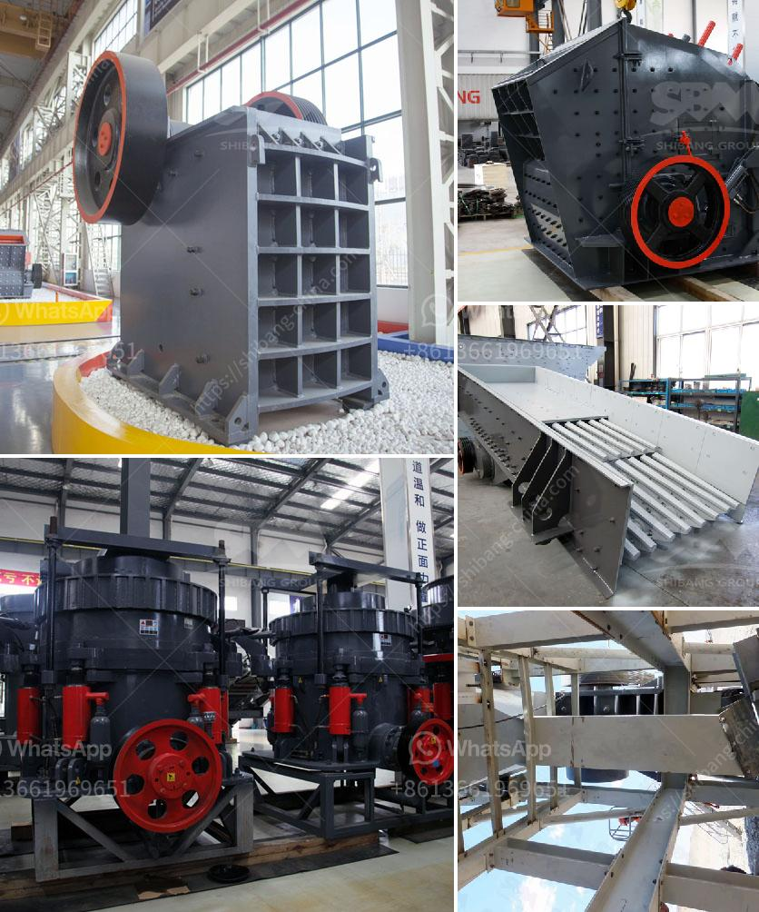

<h3>quarry business plan sample</h3>
Starting a quarry is a highly capital-intensive operation. The quarry business plan entails, among other things, the objectives of the enterprise, the products to be produced, production capacity, sales generating activities, capital requirements, and an evaluation of the risks associated with the quarrying venture.

Starting a quarry project is a massive undertaking. It involves a substantial commitment of finances, resources, and energy. The initial stage in the quarry business plan involves the acquiring of the appropriate equipment to facilitate operations. This means that you should be able to secure a range of financing options to make sure that you have the right machinery to tackle the project.

Some essential items you should budget for include excavators, loaders, trucks, generators, and a stone crusher. Additionally, you should also consider securing a dump truck to facilitate the movement of raw materials. With a suitable location and ample customer base, your construction quarry business plan will allow you effectively map out the strategies of operations.

A major part of the business plan for a quarry includes the market analysis for the venture. With the current boom in construction, as well as the growing need for commercial and residential properties, the demand for quarry products is at an all-time high. As a result, the industry is poised to experience tremendous growth, evident by the increasing number of players. By conducting a thorough market analysis, you are likely to find substantial opportunities in the market that can be tapped into.

The quarry business plan should focus on the experience and skills of the operator. They can often dictate the terms and cost of a sale. After all, if the owner is not skilled in sales, marketing, and project management, the results of the business plan will be futile. Therefore, make sure that you hire competent individuals to implement the major tenets of your business plan.

Finally, you should provide the necessary funds needed to ensure the implementation of the business plan. The essence of a business plan cannot be overemphasized; it is the driving force behind a successful business venture. Investing in your own business is a smart way to recoup your investment and achieve your aspirations.

In conclusion, a quarry business plan sample provides you with a flexible business model that enables you to contend with several uncertainties in the quarrying industry. You can establish a successful quarrying project without a quarry business plan. However, you can't do it without the necessary resources and sufficient capital. Once you have these in place, you will need to curate your business plan carefully to ensure that it is not only relevant and realistic but also tailored to meet the specific needs of your quarrying business.   
<h3>Contact us</h3><ul><li><strong>Whatsapp:&nbsp;<a href="https://wa.me/8613661969651">+8613661969651</a></strong></li><li><a href="https://swt.shibang-china.com/?git&amp;zhl&amp;quarry business plan sample"><strong>Online Service(chat now)</strong></a></li></ul><h3>Related</h3><ul><li><a href='hydraulic concrete crusher.md'>hydraulic concrete crusher</a></li><li><a href='stone crushing plant manufacturers in.md'>stone crushing plant manufacturers in</a></li><li><a href='safety of belt conveyors in hindi.md'>safety of belt conveyors in hindi</a></li><li><a href='stone crusher sale in peru.md'>stone crusher sale in peru</a></li><li><a href='quartz mining equipments.md'>quartz mining equipments</a></li></ul>