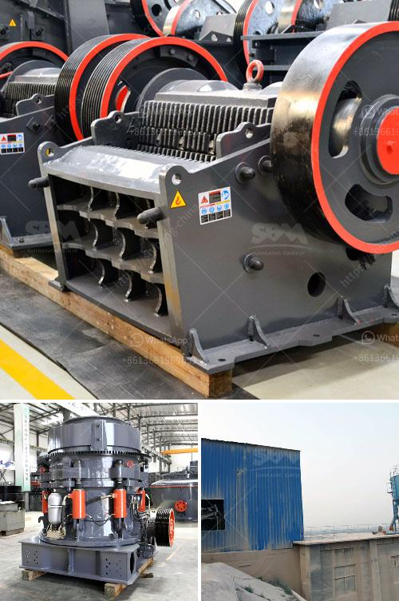

<h3>quarry business plan</h3>
A lucrative Mining Quarry Business Plan with Feasibility Study for Sand Gravel Clay Mining for Nigerians

That is a profit making venture any day, anytime. Ready to go into this business? You can't go wrong with this article.

There is no need having the best of products and services when people don't know about it. This is where marketing comes in. Marketing is important to every business, whether big or small. Although you might not have the funds to advertise on billboards or television, you can still get the word out there through online marketing.

One important factor that cannot be ignored when marketing your quarry business is the location of your quarry. You must ensure that your quarry is strategically positioned to sell to customers within the vicinity. This will make it easier for potential customers to locate you.

Another important factor is the availability of raw materials. You must ensure that there is a constant supply of materials to keep your quarry running. This is why it is important to have good relationships with suppliers.

Furthermore, having a well-documented business plan is crucial for the success of your quarry. The business plan should include vital information about your quarrying business such as the startup costs, projected revenue, market analysis, and so on. It is important to develop a comprehensive business plan before starting a quarry business.

In summary, a quarry business can be profitable if it is run efficiently. However, in order to run a successful quarry business, there are several factors that need to be considered, including location, availability of raw materials, and the ability to sell the product. This article outlines a step-by-step plan for starting a successful quarry business.
<h3>Contact us</h3><ul><li><strong>Whatsapp:&nbsp;<a href="https://wa.me/8613661969651">+8613661969651</a></strong></li><li><a href="https://swt.shibang-china.com/?git&amp;zhl&amp;quarry business plan"><strong>Online Service(chat now)</strong></a></li></ul><h3>Related</h3><ul><li><a href='1 tonne gypsum processing machine.md'>1 tonne gypsum processing machine</a></li><li><a href='prices of aggregate crusher plants.md'>prices of aggregate crusher plants</a></li><li><a href='slag crushing machine manufacture in india.md'>slag crushing machine manufacture in india</a></li><li><a href='calcium silicone crushers.md'>calcium silicone crushers</a></li><li><a href='prices on cone crusher parts.md'>prices on cone crusher parts</a></li></ul>