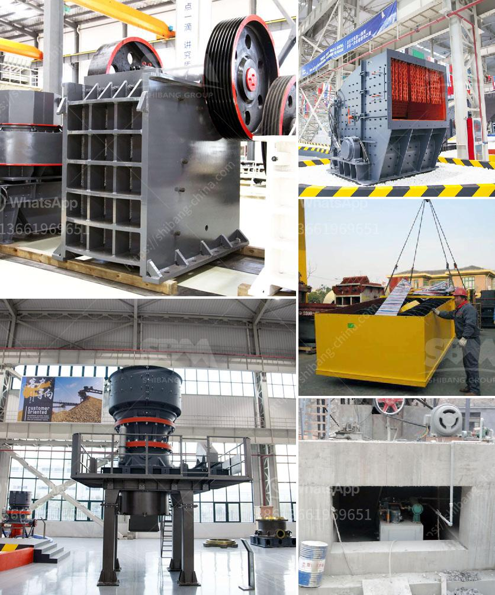

<h3>quarry crusher equipment costs</h3>
In the mining industry, quarry operations play a vital role in meeting the demands for aggregate material for various construction projects. To extract the desired materials efficiently and effectively, quarry crusher equipment is instrumental. However, the initial costs of purchasing and installing crusher equipment may be a concern for quarry owners. Understanding the expenses involved and the long-term benefits is crucial for making an informed investment decision.

One of the primary expenses associated with quarry crusher equipment is the cost of the machinery itself. Depending on the size, capacity, and functionality of the crusher, prices can vary considerably. However, it is important to remember that quarry crusher equipment serves as the backbone of the operation, directly impacting productivity and profitability. It is advisable to consider the long-term benefits rather than solely focusing on the initial investment.

Maintenance costs are another aspect to consider. Regular maintenance and repairs are essential to keep the equipment running smoothly and to ensure optimal performance. Investing in high-quality equipment from reputable manufacturers can help reduce maintenance costs and minimize downtime. Additionally, regular maintenance can extend the lifespan of the equipment, resulting in long-term savings.

Operational expenses, such as energy consumption and labor costs, should also be factored in. Utilizing modern, energy-efficient equipment can significantly reduce energy consumption, resulting in substantial cost savings over time. Moreover, equipment with advanced automation and control systems can help streamline operations, reducing the need for extensive labor and increasing productivity.

Lastly, when considering the costs of quarry crusher equipment, it is important to evaluate the overall return on investment (ROI). A well-maintained and efficient crusher can yield sizable profits by producing high-quality aggregates quickly and in large quantities. The increased productivity and reduced downtime can result in substantial revenue growth, outweighing the initial investment.

In conclusion, quarry crusher equipment costs are essential to running a successful mining operation. By understanding the expenses involved, considering long-term benefits, and prioritizing quality and efficiency, quarry owners can make informed investment decisions. Ultimately, the right equipment can enhance productivity, profitability, and the overall success of the mining industry.
<h3>Contact us</h3><ul><li><strong>Whatsapp:&nbsp;<a href="https://wa.me/8613661969651">+8613661969651</a></strong></li><li><a href="https://swt.shibang-china.com/?git&amp;zhl&amp;quarry crusher equipment costs"><strong>Online Service(chat now)</strong></a></li></ul><h3>Related</h3><ul><li><a href='complete rock crusher machine prices in pakistan.md'>complete rock crusher machine prices in pakistan</a></li><li><a href='mobile chrome crusher suppliers in south africa.md'>mobile chrome crusher suppliers in south africa</a></li><li><a href='jaw crusher with production capacity of ton hr.md'>jaw crusher with production capacity of ton hr</a></li><li><a href='minerals separation and concentration plant in nigeria.md'>minerals separation and concentration plant in nigeria</a></li><li><a href='mobile coal jaw crusher for hire.md'>mobile coal jaw crusher for hire</a></li></ul>