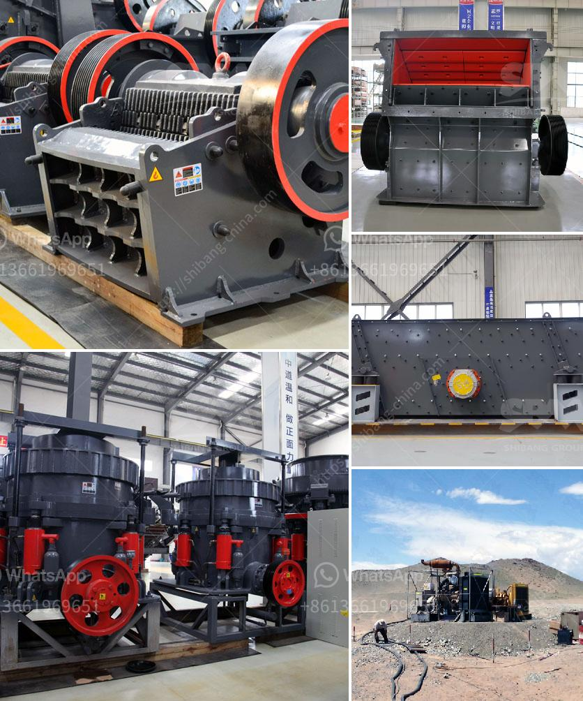

<h3>quarry crusher equipments for sale in ibadan nigeria</h3>
Quarrying is an integral part of the building and construction industry. As a matter of fact, the construction industry relies heavily on quarries to supply crushed stones, sand, and other materials needed for the construction of buildings, roads, bridges, dams, and other infrastructural projects.

In Ibadan, Nigeria, there are several quarries that supply these construction materials, and one type of equipment that plays a vital role in the production of crushed stones is a quarry crusher. These are heavy-duty machines designed to crush large rocks into smaller rocks, gravel, or dust.

A quarry crusher consists of a variety of components, including a feed hopper, a crushing chamber, a vibrating screen, and several conveyors. The materials are transported by large trucks from the quarry and dumped into the hopper. The vibrating feeder feeds the materials into the crushing chamber, where they are crushed by the rotating hammers of the crusher. The crushed stones are then screened by the vibrating screen to separate different sizes of stones. The conveyors transport the crushed stones to the designated areas for further processing or stockpiling.

There are various types of quarry crushers available in Ibadan, Nigeria. Some of the popular models include the PE series jaw crusher, PF series impact crusher, cone crusher, VSI crusher, and mobile crusher. These crushers offer advanced crushing technology, high crushing efficiency, and reliable performance. They are also equipped with safety features to ensure the protection of operators and maximize productivity.

If you are in the market for quarry crusher equipment in Ibadan, Nigeria, there are several reputable manufacturers and suppliers you can consider. They offer a wide range of crushers suitable for different quarrying applications and budgets. Additionally, they provide after-sales support, spare parts, and maintenance services to ensure the smooth operation of the equipment.

In conclusion, quarry crusher equipment plays a crucial role in the production of construction materials in Ibadan, Nigeria. With the right equipment, quarrying operations can be more efficient and productive, resulting in the timely completion of construction projects. Therefore, if you are in need of quarry crusher equipment, make sure to explore the options available in Ibadan, Nigeria.
<h3>Contact us</h3><ul><li><strong>Whatsapp:&nbsp;<a href="https://wa.me/8613661969651">+8613661969651</a></strong></li><li><a href="https://swt.shibang-china.com/?git&amp;zhl&amp;quarry crusher equipments for sale in ibadan nigeria"><strong>Online Service(chat now)</strong></a></li></ul><h3>Related</h3><ul><li><a href='gold washing machine for sale in tanzania.md'>gold washing machine for sale in tanzania</a></li><li><a href='jaw crusher in german.md'>jaw crusher in german</a></li><li><a href='malaysia conveyor belts price.md'>malaysia conveyor belts price</a></li><li><a href='stone crusher portable.md'>stone crusher portable</a></li><li><a href='limestone crusher screening types plant.md'>limestone crusher screening types plant</a></li></ul>