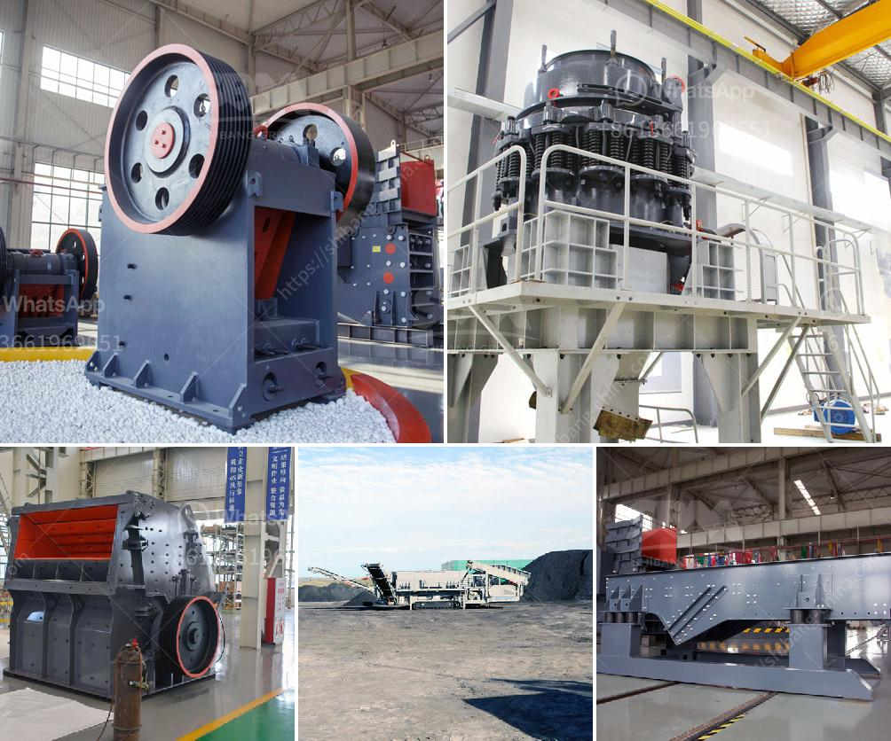

<h3>quarry crusher plant in ethiopia</h3>
Quarrying refers to the process of extracting and breaking large stones from the Quarry into smaller sizes for various construction and infrastructure purposes. In Ethiopia, this process is essential as it provides building materials such as sand, gravel, and crushed stones, which are required for both residential and commercial projects.

The quarry crusher plant in Ethiopia plays a vital role in the Ethiopian economy by providing construction materials and creating job opportunities. This is mainly achieved by the abundant supply of raw materials from the quarry site, which is then processed into various sizes and shapes.

One primary advantage of a quarry crusher plant is the uninterrupted production process it offers. With the continuous supply of raw materials, construction companies don't have to worry about shortages, enabling them to meet project deadlines efficiently. This steady supply also helps keep construction costs under control, as materials are readily available.

In addition to the economic benefits, the quarry crusher plant also contributes to the country's infrastructure development. The crushed stones produced can be used for road construction, building foundations, and railway projects. These projects play a crucial role in connecting cities and regions, improving transportation accessibility, and promoting trade and economic growth.

Furthermore, the quarry crusher plant in Ethiopia adheres to strict environmental regulations and promotes sustainable practices. It incorporates measures such as dust suppression systems, water recycling, and proper waste management to minimize the environmental impact. This ensures that natural resources are utilized responsibly and that the surrounding ecosystems are protected.

To conclude, the quarry crusher plant in Ethiopia plays a significant role in the country's construction industry. It provides a continuous supply of raw materials, helps meet project deadlines, contributes to infrastructure development, and promotes sustainable practices. All these factors make the quarry crusher plant essential for the growth and development of Ethiopia's economy.
<h3>Contact us</h3><ul><li><strong>Whatsapp:&nbsp;<a href="https://wa.me/8613661969651">+8613661969651</a></strong></li><li><a href="https://swt.shibang-china.com/?git&amp;zhl&amp;quarry crusher plant in ethiopia"><strong>Online Service(chat now)</strong></a></li></ul><h3>Related</h3><ul><li><a href='sewa mobile stone crusher di indonesia.md'>sewa mobile stone crusher di indonesia</a></li><li><a href='cement plant machinery supplier in korea.md'>cement plant machinery supplier in korea</a></li><li><a href='between cone and horizontal impact crusher.md'>between cone and horizontal impact crusher</a></li><li><a href='coal crushing and screening plant for sale south africa.md'>coal crushing and screening plant for sale south africa</a></li><li><a href='sand screening machines in south africa.md'>sand screening machines in south africa</a></li></ul>