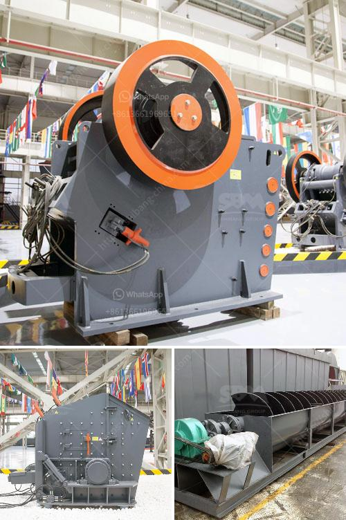

<h3>quarry crusher plant in malaysia</h3>
Quarry crusher plant in Malaysia is becoming more and more popular. The quarry crusher plant is a specialized production line designed for the high-quality sand and gravel aggregate production, which is widely used in construction, highway, railway, water conservancy, and other industries. The quarry crusher plant can save 15% to 20% energy compared with the traditional crushing production line. It can process materials with moisture content less than 5%, such as limestone, granite, basalt, and so on.

The quarry crusher plant is made up of vibrating feeder, jaw crusher, impact crusher, cone crusher, VSI crusher, vibrating screen, belt conveyor, and other equipment. The equipment is highly efficient, low in energy consumption, and durable. With the combination of various types of equipment, different process requirements can be met to achieve high-efficiency production.

Malaysia has abundant limestone resources, which are mainly used in cement production, metallurgy, and other fields. The limestone in Malaysia is of high quality and reserves are relatively large. After processing, limestone can be used in various industries, such as construction, road construction, and so on.

The quarry crusher plant in Malaysia has production capacity from 50tph to 1000tph. The input size is less than 930mm, and the output size is less than 75mm. In terms of production efficiency and equipment durability, the quarry crusher plant has been highly recognized by customers.

The quarry crusher plant price is also very impressive in the market. As a professional manufacturer of mining equipment, SBM Company not only provides customers with high-quality machines, but also offers reasonable, customized solutions to meet different needs and budgets. In addition, SBM Company's after-sales service is also considerate and comprehensive, providing customers with priority service.

In conclusion, the quarry crusher plant in Malaysia is an essential equipment in the construction industry for high-quality sand and gravel aggregate production. SBM Company provides customers with high-quality machines and customized solutions at a reasonable price, making their investment more valuable and productive.
<h3>Contact us</h3><ul><li><strong>Whatsapp:&nbsp;<a href="https://wa.me/8613661969651">+8613661969651</a></strong></li><li><a href="https://swt.shibang-china.com/?git&amp;zhl&amp;quarry crusher plant in malaysia"><strong>Online Service(chat now)</strong></a></li></ul><h3>Related</h3><ul><li><a href='automation coal crushing and conveyor.md'>automation coal crushing and conveyor</a></li><li><a href='minerals separation and concentration plant in nigeria.md'>minerals separation and concentration plant in nigeria</a></li><li><a href='grinding mill material.md'>grinding mill material</a></li><li><a href='ballast crusher line.md'>ballast crusher line</a></li><li><a href='impact crusher saudi arabia.md'>impact crusher saudi arabia</a></li></ul>