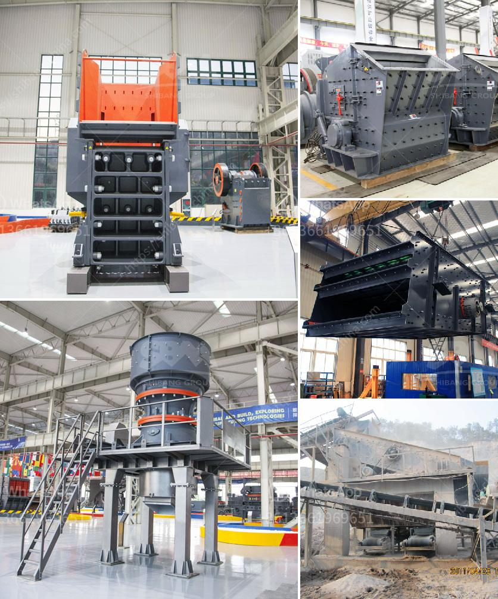

<h3>quarry crusher with 60 tph</h3>
The quarry crusher is an essential equipment in the gravel production line. It is mainly used to crush large pieces of stones into smaller particles for further processing. With a capacity of 60 tph, the quarry crusher is capable of producing high-quality sand and gravel aggregates.

One of the key features of the quarry crusher is its high efficiency. It adopts a unique crushing cavity design, which improves the crushing efficiency by 30% compared to traditional crushers. This means that more materials can be crushed per unit of time, resulting in higher production capacity.

Another advantage of the quarry crusher is its low energy consumption. It is equipped with an advanced hydraulic system, which can automatically adjust the discharge port and control the feeding speed. This not only ensures the uniformity of the finished products but also reduces the energy consumption during the crushing process.

In addition to its high efficiency and low energy consumption, the quarry crusher also has a stable and reliable performance. It is made of high-quality materials and adopts advanced manufacturing technology, which ensures its durability and long service life. Moreover, it is equipped with various protective devices, such as overload protection and automatic lubrication system, to ensure the safe and reliable operation of the equipment.

The quarry crusher with a capacity of 60 tph is suitable for small and medium-sized sand and gravel production lines. It can crush limestone, granite, basalt, pebbles, and other materials with a compressive strength of less than 320 MPa. The final product size can be adjusted according to the users’ requirements, such as 0-5mm, 5-10mm, 10-20mm.

In conclusion, the quarry crusher with 60 tph is an essential equipment in the gravel production line. It has the advantages of high efficiency, low energy consumption, stable and reliable performance. It is suitable for crushing various stones and can produce high-quality sand and gravel aggregates. Whether for construction projects or road maintenance, the quarry crusher plays a significant role in the infrastructure industry. With its excellent performance, it is widely used and favored by users in the mining and quarrying industry.
<h3>Contact us</h3><ul><li><strong>Whatsapp:&nbsp;<a href="https://wa.me/8613661969651">+8613661969651</a></strong></li><li><a href="https://swt.shibang-china.com/?git&amp;zhl&amp;quarry crusher with 60 tph"><strong>Online Service(chat now)</strong></a></li></ul><h3>Related</h3><ul><li><a href='stone crusher america.md'>stone crusher america</a></li><li><a href='lime and dolomite plant details.md'>lime and dolomite plant details</a></li><li><a href='stone crusher second hand south africa.md'>stone crusher second hand south africa</a></li><li><a href='crusher sand washing machines for crusher nepal.md'>crusher sand washing machines for crusher nepal</a></li><li><a href='harga powerful crusher machine.md'>harga powerful crusher machine</a></li></ul>