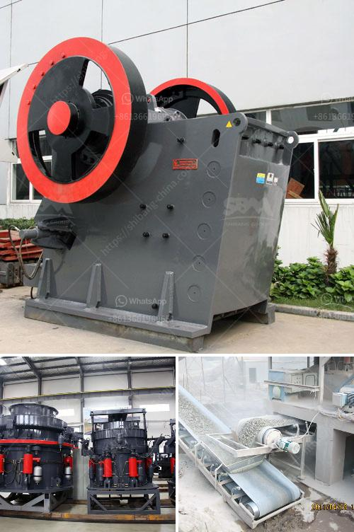

<h3>quarry crushing equipment</h3>
The importance of quarry crushing equipment in the infrastructure construction industry is enormous, as it plays a crucial role in the processing of aggregates and in the production of sand and other materials for various applications. In recent years, the demand for quarry products has been on the rise, helping boost the sustainable development of both the mining and construction industries.

Quarry crushing equipment, also known as gravel crushers or stone crushers, are indispensable pieces of equipment in modular crushing plants. The purpose of quarry crushing equipment is to reduce the particle size of the raw materials so that they can be transported to the next stage of the crushing process. The equipment can be used in various industries, ranging from mining and construction to the recycling of demolition waste.

One of the main benefits of quarry crushing equipment is its ability to produce materials of different specifications. This flexibility allows companies to cater to a wide range of customer demands and project requirements. Additionally, the equipment is designed to efficiently process large volumes of material, ensuring continuous production and increased profitability.

Moreover, quarry crushing equipment contributes to sustainable construction practices. By processing quarry materials on-site, companies can significantly reduce transportation costs and carbon emissions associated with the transportation of raw materials. Utilizing locally sourced materials also helps preserve natural resources and reduces the impact on the environment.

Modern quarry crushing equipment is equipped with advanced technologies that improve efficiency and ensure product quality. For instance, intelligent control systems help optimize the crushing process, leading to higher productivity and better end-product shape. Furthermore, dust suppression systems and noise reduction features prioritize the health and safety of workers and nearby communities.

In conclusion, quarry crushing equipment is more than just a tool. It is an essential asset that contributes to the sustainability of the construction industry. By processing materials on-site and delivering consistent high-quality products, quarry crushing equipment plays a vital role in the creation of environmentally friendly infrastructure. As the demand for quarry products continues to grow, investing in advanced crushing equipment becomes essential to meet market demands and achieve long-term success.
<h3>Contact us</h3><ul><li><strong>Whatsapp:&nbsp;<a href="https://wa.me/8613661969651">+8613661969651</a></strong></li><li><a href="https://swt.shibang-china.com/?git&amp;zhl&amp;quarry crushing equipment"><strong>Online Service(chat now)</strong></a></li></ul><h3>Related</h3><ul><li><a href='harga powerful crusher machine.md'>harga powerful crusher machine</a></li><li><a href='coal crushing plant for sale in south africa.md'>coal crushing plant for sale in south africa</a></li><li><a href='crusher price in philippines.md'>crusher price in philippines</a></li><li><a href='belt conveyor for sale china.md'>belt conveyor for sale china</a></li><li><a href='stone crushing plant manufacturers in.md'>stone crushing plant manufacturers in</a></li></ul>