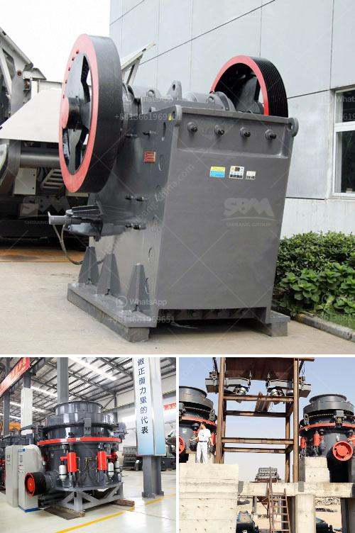

<h3>quarry equipment china</h3>
China is the largest producer of aggregate materials in the world and its quarry operations have been expanding at a rapid pace. However, the industry's rapid development also brings challenges in terms of resources, energy consumption, and environmental protection. To address these challenges, Chinese quarry operators are increasingly investing in advanced equipment that allows them to maximize productivity while minimizing their environmental impact.

Quarry equipment refers to the various types of machinery used in quarrying activities, such as drilling, cutting, crushing, screening, and loading. China is a popular destination for quarrying equipment, as the country boasts a vast network of manufacturers and suppliers offering competitive prices.

The demand for quarry equipment in China is expected to significantly rise due to the country's ambitious infrastructure development plans. The Chinese government's focus on urbanization, construction of highways, railways, and airports is driving the demand for aggregates, making quarrying equipment crucial for efficient operations.

Chinese manufacturers of quarry equipment offer a wide range of products to cater to the diverse needs of quarry operators. From mobile crushers and screeners to heavy-duty machinery, they provide a comprehensive solution for extracting, processing, and transporting materials. These equipment are designed with advanced technologies, ensuring high performance, durability, and efficiency.

Moreover, quarry equipment manufacturers in China are increasingly adopting sustainable practices to minimize environmental impact. They are using advanced dust suppression systems, efficient energy management systems, and incorporating green materials in the construction of machinery. This demonstrates their commitment to complying with strict environmental regulations and providing environmentally friendly solutions to their customers.

In conclusion, China's quarry equipment industry is witnessing significant growth, driven by infrastructure development and increasing demand for aggregates. Quarry operators are investing in state-of-the-art machinery to maximize productivity, reduce energy consumption, and minimize their impact on the environment. With a vast network of manufacturers and suppliers, China remains a top destination for quarry equipment, providing comprehensive solutions to meet the diverse needs of the mining industry.
<h3>Contact us</h3><ul><li><strong>Whatsapp:&nbsp;<a href="https://wa.me/8613661969651">+8613661969651</a></strong></li><li><a href="https://swt.shibang-china.com/?git&amp;zhl&amp;quarry equipment china"><strong>Online Service(chat now)</strong></a></li></ul><h3>Related</h3><ul><li><a href='silica sand mines in maharashtra.md'>silica sand mines in maharashtra</a></li><li><a href='vibrating screen in egypt.md'>vibrating screen in egypt</a></li><li><a href='copper mining companies in congo.md'>copper mining companies in congo</a></li><li><a href='gypsum mining companies in kenya.md'>gypsum mining companies in kenya</a></li><li><a href='stone crusher pfs price.md'>stone crusher pfs price</a></li></ul>