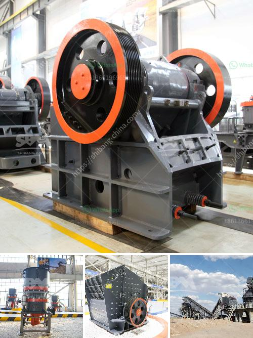

<h3>quarry equipment manufacturers</h3>
Quarries play a vital role in our modern society as they provide much-needed materials for construction projects, industrial production, and infrastructure development. These extensive excavation sites require specialized equipment to extract, transport, and process the raw materials. Quarry equipment manufacturers play a critical role in supplying and maintaining the machinery needed for these challenging environments.

The primary goal of quarry equipment manufacturers is to efficiently meet the demands of their customers. Since each quarry has specific requirements depending on the materials being extracted and the scale of operations, manufacturers must provide a diverse range of equipment options. This can include large-scale machinery such as crushers, conveyors, and screening equipment, as well as smaller tools like drilling rigs and wheel loaders.

One notable manufacturer in this industry is Caterpillar. With a long-standing reputation for producing high-quality construction and mining equipment, Caterpillar offers a wide range of products specifically designed for the quarrying sector. They have a vast selection of machines capable of handling various tasks, from excavating rock and sand to transporting materials and even recycling waste. Caterpillar's commitment to innovation ensures that their equipment is reliable, productive, and environmentally friendly.

Another prominent manufacturer is Sandvik. With a rich history in mining and rock excavation, Sandvik specializes in providing advanced technology solutions for the quarrying industry. Their equipment portfolio includes rock drilling tools, crushers, screens, and loaders. Sandvik focuses on incorporating cutting-edge automation and digitalization features into their machines to improve efficiency and reduce human error, making them a preferred choice for many quarry operators.

Quarry equipment manufacturers understand the importance of delivering reliable and durable machinery. The harsh conditions and constant use in quarries necessitate robust and long-lasting equipment. Manufacturers invest significant resources in research and development to ensure their machines can withstand the demanding environment. This includes using high-quality materials, implementing effective cooling systems, and regularly testing the equipment's performance under extreme conditions. By prioritizing durability, manufacturers instill confidence in their customers that their investment will yield long-term benefits.

In recent years, sustainability has become a major concern in the quarrying industry. Manufacturers are increasingly focusing on providing eco-friendly solutions that reduce carbon emissions and minimize the environmental impact of quarrying operations. This includes creating machinery that is energy-efficient, using alternative fuels, and implementing recycling systems to reduce waste. By embracing sustainability, equipment manufacturers not only contribute to environmental preservation but also attract conscientious customers who prioritize sustainable practices.

In conclusion, quarry equipment manufacturers are pivotal to the success of the quarrying industry by providing efficient and reliable machinery. Companies like Caterpillar and Sandvik are at the forefront of innovation, offering a diverse range of equipment to meet the specific needs of each quarry. With a focus on durability and sustainability, these manufacturers ensure that their machines can withstand harsh conditions while minimizing their impact on the environment. As the demand for raw materials continues to increase, quarry equipment manufacturers will play a central role in supplying essential machinery for the construction and infrastructure sectors.
<h3>Contact us</h3><ul><li><strong>Whatsapp:&nbsp;<a href="https://wa.me/8613661969651">+8613661969651</a></strong></li><li><a href="https://swt.shibang-china.com/?git&amp;zhl&amp;quarry equipment manufacturers"><strong>Online Service(chat now)</strong></a></li></ul><h3>Related</h3><ul><li><a href='china vertical roller mill prices.md'>china vertical roller mill prices</a></li><li><a href='flow chart for gold extraction from ores.md'>flow chart for gold extraction from ores</a></li><li><a href='vertical mill of a cement company.md'>vertical mill of a cement company</a></li><li><a href='hammer mill design plans pdf mtm crusher.md'>hammer mill design plans pdf mtm crusher</a></li><li><a href='stone crusher dijual.md'>stone crusher dijual</a></li></ul>