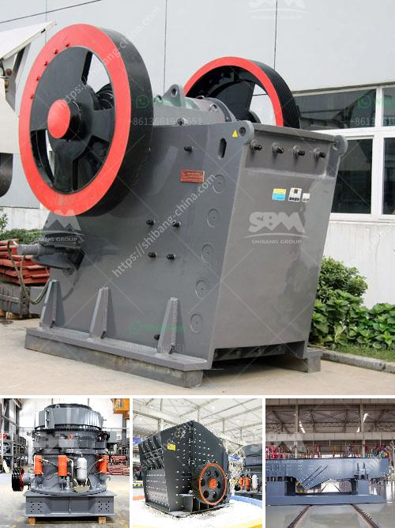

<h3>quarry jaw crusher</h3>
A quarry is a site where a stone or gravel producer extracts a variety of raw materials from the earth. Common types of material extracted in quarrying activities include limestone, granite, and sand. The equipment and machinery used in quarrying are vital to the success of any quarrying operation. However, the heart of any quarrying operation is the quarry jaw crusher.

The primary purpose of a quarry jaw crusher is to reduce large pieces of rock into smaller pieces of rock as per the requirement. It is used for various industrial purposes including road construction, building construction, mining, metallurgy, water conservancy, and chemical industries. With the growing infrastructure development projects, the demand for quarry jaw crushers has increased significantly.

One of the most commonly used quarry jaw crushers is the single toggle jaw crusher. This machine uses a stationary jaw plate and a moving jaw plate to create a motion that compresses the feed material into smaller pieces. The movement of the jaw plates creates a biting action that helps to break down larger rocks into smaller ones. The single toggle design ensures efficient and reliable operation, minimizing downtime and maximizing production.

Another popular type of quarry jaw crusher is the double toggle jaw crusher. This machine uses two toggle plates to create a swing motion that helps to break down larger rocks. The double toggle design provides a more aggressive crushing action, resulting in a higher output capacity. It is particularly suitable for applications where large quantities of material need to be processed efficiently.

A key feature of a quarry jaw crusher is its versatility. It can be used for primary crushing of various types of rock, including granite, limestone, and basalt. Additionally, it can handle different sizes of feed material, ranging from small stones to larger rocks. This flexibility makes quarry jaw crushers suitable for a wide range of applications and ensures their continued use in the quarrying industry.

When choosing a quarry jaw crusher, several factors need to be considered. The first factor is the feed size of the material to be crushed. The crusher should be able to handle the maximum feed size without causing any blockages or excessive wear. Additionally, the crusher's capacity should match the production requirements of the quarry.

The second factor to consider is the maintenance requirements of the jaw crusher. Regular inspection and maintenance can help to prevent costly downtime and extend the lifespan of the machine. Lubrication of the bearing and replacement of worn parts are common maintenance activities for a quarry jaw crusher.

Finally, the cost of the jaw crusher should be considered. The initial purchase cost, as well as the operating and maintenance costs, should be evaluated to ensure that the crusher provides a good return on investment.

In conclusion, a quarry jaw crusher is a crucial piece of equipment in the quarrying industry. It plays a vital role in the extraction and crushing of various types of raw materials. Its versatility, efficiency, and reliability make it an essential tool in any quarrying operation. With proper selection and maintenance, a quarry jaw crusher can provide years of efficient and reliable service, contributing to the success of the quarrying business.
<h3>Contact us</h3><ul><li><strong>Whatsapp:&nbsp;<a href="https://wa.me/8613661969651">+8613661969651</a></strong></li><li><a href="https://swt.shibang-china.com/?git&amp;zhl&amp;quarry jaw crusher"><strong>Online Service(chat now)</strong></a></li></ul><h3>Related</h3><ul><li><a href='balls for mining mill.md'>balls for mining mill</a></li><li><a href='dolomite crusher manufacture plant.md'>dolomite crusher manufacture plant</a></li><li><a href='impact crusher specification limestone.md'>impact crusher specification limestone</a></li><li><a href='vertical roller mill for cement german.md'>vertical roller mill for cement german</a></li><li><a href='jual stone crusher merk.md'>jual stone crusher merk</a></li></ul>