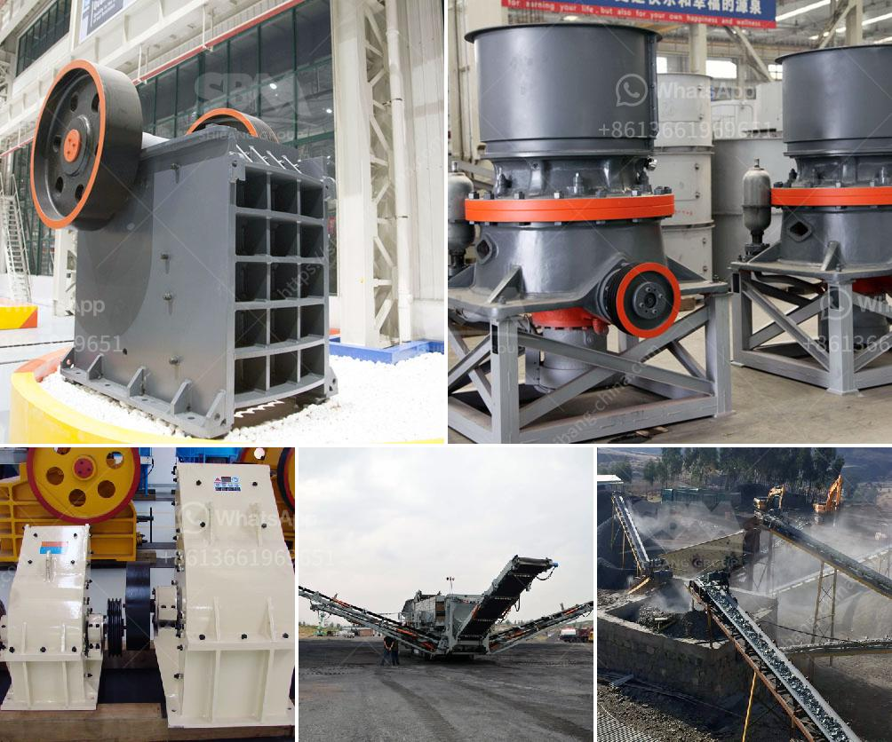

<h3>quarry machine price</h3>
Quarrying is a lucrative and heavily regulated industry worldwide, as it involves the extraction of valuable natural resources, mainly minerals and stones. These materials are essential for various construction projects, creating a consistent demand for quarry machines. Quarry machines are heavy equipment used in extraction and processing operations, designed to handle large rocks, minerals, and stones efficiently and effectively.

When it comes to quarry machines' pricing, several factors influence their cost. One crucial factor is the type of machine required for the specific quarrying operation. There are various types of quarry machines available, including crushers, screeners, loaders, excavators, and haulers. Each machine has its own unique features, capabilities, and cost.

Crushers are vital machines in quarrying operations as they break down large rocks into smaller, more manageable sizes. There are different types of crushers, such as jaw crushers, impact crushers, and cone crushers, each with varying capabilities and prices. Jaw crushers are more commonly used in quarrying operations and tend to have lower prices compared to impact crushers or cone crushers.

Screeners are another essential machine in the quarrying process, used for sorting and separating various-sized materials. They come in different sizes and configurations, such as vibrating screens or trommel screens. Like crushers, the cost of screeners varies based on their size, quality, and functionality.

Loaders are heavy machinery used to scoop up and transport materials within the quarry site. They play a crucial role in efficiently moving large volumes of materials. Loader prices depend on factors such as their lifting capacity, speed, and fuel efficiency.

Excavators are versatile machines that can be used for various tasks in a quarry, such as digging, loading, and leveling. They come in different sizes and specifications, influencing their price. Larger excavators tend to be more expensive due to their higher capacity and capabilities.

Haulers, also known as dump trucks, are used for transporting materials from the quarry site to the designated location. Their prices vary depending on factors like capacity, fuel efficiency, and durability. More advanced models with features like automatic transmissions or improved loading times are typically priced higher.

In addition to the machine's type and specifications, the brand and its reputation also affect the pricing. Well-established and reputable brands often come with a premium price tag due to their reliability, quality, and after-sales service. However, small-scale operations or those on a budget might opt for lesser-known brands or used machines to reduce costs.

Furthermore, regional factors can influence quarry machine prices. Supply and demand dynamics, import/export regulations, and local taxes can all impact the final pricing.

Everyone involved in the quarrying industry, whether operators or investors, aims to strike a balance between the upfront cost and long-term benefits of quarry machines. Determining the right machine type, size, and brand that align with the specific operational requirements can help optimize both cost and efficiency.

It is important to note that price should not solely dictate the purchasing decision. Factors like machine reliability, durability, maintenance costs, and after-sales service should be considered as well. Investing in a high-quality quarry machine might require a higher upfront cost but can result in long-term savings and increased productivity.

In conclusion, quarry machine prices vary depending on multiple factors, including machine type, specifications, brand, region, and market dynamics. Understanding the specific requirements, considering long-term benefits, and balancing cost and quality are essential in making an informed decision when purchasing quarry machines.
<h3>Contact us</h3><ul><li><strong>Whatsapp:&nbsp;<a href="https://wa.me/8613661969651">+8613661969651</a></strong></li><li><a href="https://swt.shibang-china.com/?git&amp;zhl&amp;quarry machine price"><strong>Online Service(chat now)</strong></a></li></ul><h3>Related</h3><ul><li><a href='hammer mill prices.md'>hammer mill prices</a></li><li><a href='crushers manufacturers in south africa.md'>crushers manufacturers in south africa</a></li><li><a href='hydration process of cement.md'>hydration process of cement</a></li><li><a href='limestone crusher screening types plant.md'>limestone crusher screening types plant</a></li><li><a href='bentonite mill project report.md'>bentonite mill project report</a></li></ul>