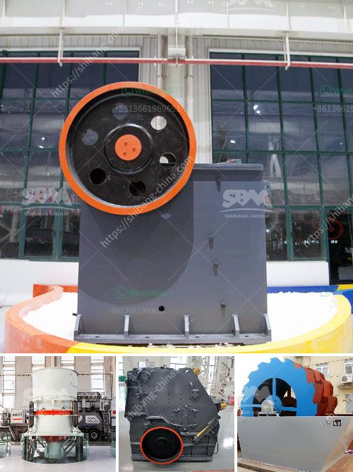

<h3>quarry of stone crusher in pakistan pdf</h3>
Quarry of stone crusher in Pakistan pdf is a leading global manufacturer of crushing and milling equipment (quarry of stone crusher in Pakistan pdf), also supply individual (quarry of stone crusher in Pakistan pdf...) crushers and mills as well as spare parts of them. Offer advanced, rational solutions for any size-reduction requirements, including quarry, aggregate, grinding production and complete plant plan. quarry of stone crusher in Pakistan pdf... Stone Crushing Machine. Stone Crusher Machine Manufacturer in Cathay Phillips China.Our Stone Crushing Plant have exported to South Africa,India,Canada,Indonesia ,Kenya ,Pakistan,Tajikistan ,and are widely applied in mica ,limestone ,feldspar ,kaolin ,marble ,Silica ,Bauxite ,Chrome ,Granite ,Iron ore ,Copper Ore ,Gold Ore ,Silver Ore processing. can supply the right crusher as well as complete crushing plant to meet your material reduction requirements. 

quarry of stone crushers are increasingly used on mining fields of crushed stone and also with the preparation of the construction material in construction engineering sites (highways, tunnels and building construction). It is a complex building material consisting mainly of aggregate, cement, gravel, crushed stone and water. Since the natural aggregate, sand and gravels as materials for concrete are limited in the world. SBM cone crusher is the best choice as the second crusher. The diverse granite process line also includes granite screeners, belt conveyors and vibrating feeders.

SBM granite processing plants have everything on board: feeders, crusher, screen, and power installation with simple and robust construction for high availability. -- Pine Jack, Manager

SBM crusher machine have modular components for easy replacement and durable wear parts for less downtime. -- CJ. Watson, Director

We have decided to increase the purchasing of SBM Machinery as it chases what it says is highly efficient and environmental friendly. -- Michael Bell, Author

Escondida's proved and probable reserves are currently 3,900Mt, HPC cone crusher is a key equipment for the copper ore beneficiation plant to achieve the goal. -- Jame Green, Doctor

SBM as one of the largest mining and crushing equipments manufacturers and vendors all over the world, we provide cone crusehr, jaw crusher, grinding mill, mobile crusher, ball mill, washer machine, vibrating screen, belt conveyor, etc for quarry plant to process iron, gold, aggregate, artificial sand, limestone, asphalt, ballast, bauxite, brick, cement, ceramic, clay, concrete, construction, glass, gypsum, kaolin, coke, coal, barite, bentonite, clinker, dolomite, earth, feldspar, fluorspar, fly ash, garnet, graphite, gravel, marble, talc, mica, perlite, porcelain, pozzolana, quartz, rubble, salt, silica, slate, soapstone, soda, sizing, bottle, aluminum, antimony, calcium, chrome, copper, diamond, hematite, Lead, lithium, magnesium, magnetite, manganese, molybdenum, nickel, pyrite, anthracite,etc. 

SBM company provide quarry plant machine for India, Oman, Vietnam, Malaysia, Philippines, Amercia, Indonesia, Sri lanka, Ghana, Uae, Iran, Korea, Japan, Turkey, Kuwait, Saudi arabia, Australia, Thailand, Burma, Yemen, UK, Hungary, British, France, Russian, Gemany, England, Kenya, Zimbabwe, Tanzania, Nigera, Botswana, SA, Nigeria, Uganda, Gabon, Zambia, Ethiopia , Mauritania, USA, Canada, Peru, etc more than 100 countries.
<h3>Contact us</h3><ul><li><strong>Whatsapp:&nbsp;<a href="https://wa.me/8613661969651">+8613661969651</a></strong></li><li><a href="https://swt.shibang-china.com/?git&amp;zhl&amp;quarry of stone crusher in pakistan pdf"><strong>Online Service(chat now)</strong></a></li></ul><h3>Related</h3><ul><li><a href='used quarry crusher machine germany.md'>used quarry crusher machine germany</a></li><li><a href='stone hammer mill machine.md'>stone hammer mill machine</a></li><li><a href='cutting milling machine for marble and granite.md'>cutting milling machine for marble and granite</a></li><li><a href='used ez screen plant 1200 xl for sale.md'>used ez screen plant 1200 xl for sale</a></li><li><a href='company manufactures the best ball mill.md'>company manufactures the best ball mill</a></li></ul>