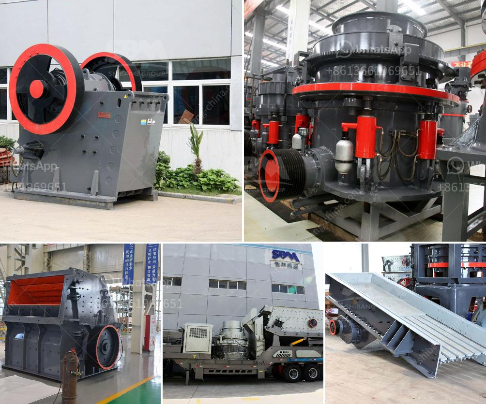

<h3>quarry rock stone crusher germany machine manufacturer</h3>
Germany is abundant of crushed rock resources. In Germany, the rock quarry plant has wide application in secondary, tertiary and fine crushing. It can process materials with capacities ranging from 1-300tph. The final products with cubic shapes are the ideal materials for highway, water conservancy and airport construction. The impact crusher plant is widely used in hard rock contracting, aggregate production, in-pit crushing and mining, recycling, cement production and tunnel crushing.

The cone crushers feature a unique combination of crusher speed, throw, and cavity design. This combination has proved revolutionary in providing higher capacity and superior product quality, and in providing a wider range of application suitability. From lime-stone to taconite, from ballast production to manufactured sand, and from small portable plants, Zenith cone crushers provide unbeatable performance in secondary, tertiary, and quaternary applications.

The jaw crushers are generally used to crush hard and abrasive materials with high silica content such as a basalt, granite, quartz etc. Mechanical pressureis applied use to crush by 2 MN alloy jaw plates; one is fixed while the other reciprocates. A jaw or toggle crusher consists of a set of vertical jaws, one jaw being fixed and the other being moved back and forth relative to it by a cam or pitman mechanism. The jaws are farther apart at the top than at the bottom, forming a tapered chute so that the material is crushed progressively smaller and smaller as it travels downward until it is small enough to escape from the bottom opening.

Overall, quarry rock stone crusher germany machine manufacturer is a transition of stone crushing equipment, it has a bright future in Germany. Zenith not only provide German quarry rock crusher, but also a wide variety of stone crushers including jaw crusher, cone crusher, impact crusher and portable crushing plant. Zenith also provide small quarry rock crusher and mining mini crusher including crushing screening plant and portable mini crusher.
<h3>Contact us</h3><ul><li><strong>Whatsapp:&nbsp;<a href="https://wa.me/8613661969651">+8613661969651</a></strong></li><li><a href="https://swt.shibang-china.com/?git&amp;zhl&amp;quarry rock stone crusher germany machine manufacturer"><strong>Online Service(chat now)</strong></a></li></ul><h3>Related</h3><ul><li><a href='quartz silica old plant sale at telgana.md'>quartz silica old plant sale at telgana</a></li><li><a href='cost per hour mobile crusher.md'>cost per hour mobile crusher</a></li><li><a href='marble powder grinding plant manufacturer.md'>marble powder grinding plant manufacturer</a></li><li><a href='talc powder mill suppliers in china.md'>talc powder mill suppliers in china</a></li><li><a href='cost of limestone grinding machine.md'>cost of limestone grinding machine</a></li></ul>