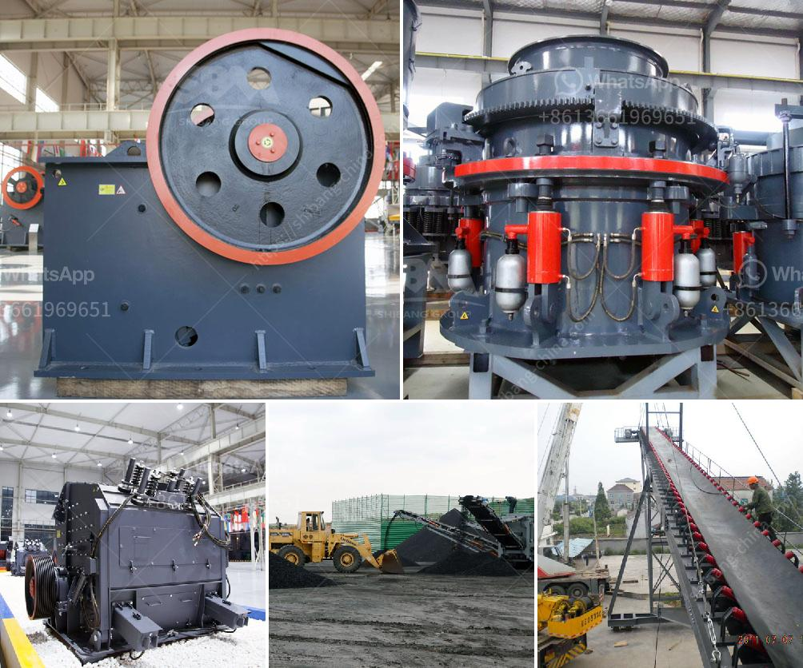

<h3>quarry screening equipment</h3>
In the quarrying industry, efficient and reliable screening equipment is essential for maximizing production and profit. Quarry screening equipment plays a crucial role in the processing of aggregate materials, from extracting the rock from the quarry to the final product. With the right equipment, the entire production process can be optimized, resulting in increased productivity and profitability.

One of the key benefits of quarry screening equipment is its ability to effectively separate materials into different sizes. This is achieved through the use of multiple decks or layers of screens, which allow for the efficient sorting of materials according to their size. By properly classifying materials, quarry operators can ensure that only the required sizes are sent to the next stage of the production process, while the undesired materials are discarded. This not only enhances efficiency but also improves the quality of the final product.

In addition to size separation, quarry screening equipment also offers the advantage of removing any contaminants or impurities from the aggregate. This is particularly important in industries such as construction and road building, where high-quality aggregates are crucial for ensuring the durability and strength of the finished structures. By effectively removing contaminants, screening equipment helps to meet the required specifications and standards for the aggregate materials, thus enhancing their value and marketability.

Another important aspect of quarry screening equipment is its ability to handle a wide variety of materials. Quarry operators deal with different types of rocks, each with its own unique characteristics. The screening equipment should be able to withstand the abrasive nature of the materials, while still maintaining its efficiency and accuracy. High-quality screening equipment is designed to handle the toughest conditions, ensuring reliable performance even in harsh quarry environments.

Moreover, modern quarry screening equipment is equipped with advanced technologies that further enhance its capabilities. For instance, some screening equipment includes features such as adjustable screening angles, which allow operators to customize the screening process according to the specific requirements of the materials being processed. Additionally, advanced screening equipment can be fitted with self-cleaning screens or anti-clogging mechanisms, reducing downtime and maintenance costs while ensuring consistent and efficient operation.

One company that specializes in providing high-quality quarry screening equipment is XYZ Quarry Solutions. With years of industry experience, XYZ Quarry Solutions offers a wide range of screening equipment options to meet the specific needs of quarry operators. Their products are known for their durability, reliability, and efficiency, enabling quarry operators to achieve optimal production and profitability.

In conclusion, quarry screening equipment is essential for enhancing efficiency in the aggregate production process. By effectively separating materials into different sizes, removing contaminants, and handling a variety of materials, it improves the overall quality and value of the final product. With the advancements in technology, modern screening equipment can deliver even greater efficiency and performance, ensuring reliable operation even in challenging quarry environments. By investing in high-quality screening equipment, quarry operators can optimize production, reduce costs, and maximize profitability.
<h3>Contact us</h3><ul><li><strong>Whatsapp:&nbsp;<a href="https://wa.me/8613661969651">+8613661969651</a></strong></li><li><a href="https://swt.shibang-china.com/?git&amp;zhl&amp;quarry screening equipment"><strong>Online Service(chat now)</strong></a></li></ul><h3>Related</h3><ul><li><a href='capital cost gold processing plant.md'>capital cost gold processing plant</a></li><li><a href='copper ore ball mill torky.md'>copper ore ball mill torky</a></li><li><a href='roller screen for coal.md'>roller screen for coal</a></li><li><a href='price of stone crusher machine in nigeria.md'>price of stone crusher machine in nigeria</a></li><li><a href='high capacity stone hammer crusher manufacturer.md'>high capacity stone hammer crusher manufacturer</a></li></ul>