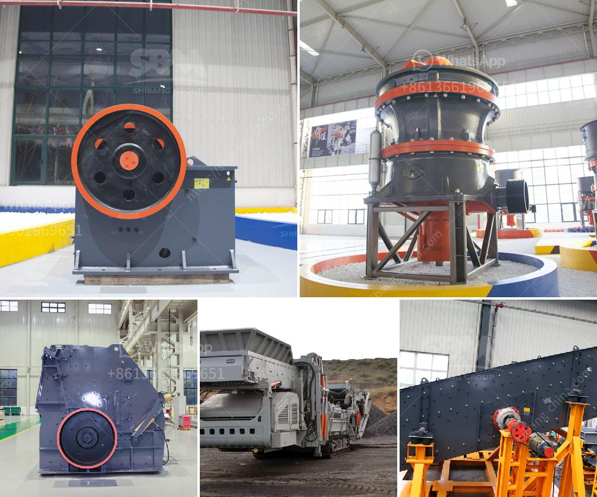

<h3>quarry stone business plan pdf</h3>
In recent years, natural stone has been in high demand, not only for residential and commercial construction projects but also for decorative elements and landscaping. Texture, unique patterns, and durability make natural stones a popular choice for many applications. If you are considering starting a quarry stone business, this article will outline the basic steps to help you get started.

Before starting any business, it's crucial to understand the market and potential demand for your products. Conducting market research will help you determine the supply and demand dynamics, competition, pricing factors, and target customers. This information will guide your business plan and assist in making informed decisions.

A comprehensive business plan is essential to outline your goals, strategies, and financial forecasts. Include information on how you plan to acquire land or lease a quarry, the machinery and tools you will need, estimated costs and revenue projections, marketing strategies, and long-term growth prospects. A well-developed business plan will not only provide clarity but also attract potential investors or lenders.

Operating a quarry stone business requires certain permits and licenses, depending on your location. Consult with local authorities to identify the required permits and ensure compliance with environmental regulations. This step is critical to avoid any legal issues in the future.

To ensure the quality and variety of your stone products, it's vital to establish relationships with reliable suppliers and contractors. Research and identify quarries that can consistently provide high-quality stones that meet your customers' demands. Additionally, finding skilled contractors who can assist with stone extraction, transportation, and processing is crucial.

The type of equipment required will depend on the scale of your operation and the desired production capacity. Essential equipment includes excavators, loaders, crushers, saws, and polishing machines. Evaluate the specifications of various equipment options, compare prices, and consider the expected maintenance and operating costs. Seek professional advice to ensure you make the right investment decisions.

A solid marketing strategy will help you reach potential customers and enhance your brand image. Create a website or online platform that showcases your stone products, their applications, and any unique features. Utilize social media platforms, attend trade shows, and participate in industry events to increase your visibility. Establish relationships with architects, contractors, and suppliers who can recommend your products to their clients.

In the natural stone industry, customer satisfaction and reputation are paramount. Prioritize exceptional customer service and establish efficient communication channels to address customers' inquiries, provide professional advice, and address any concerns promptly. Word-of-mouth recommendations can significantly contribute to the growth of your quarry stone business.

Remember, starting a quarry stone business involves substantial investment, careful planning, and consistent effort. It's essential to remain dedicated, adapt to changing market trends, and continually improve the quality and variety of your stone products. With proper execution, a quarry stone business can thrive and become a profitable venture.
<h3>Contact us</h3><ul><li><strong>Whatsapp:&nbsp;<a href="https://wa.me/8613661969651">+8613661969651</a></strong></li><li><a href="https://swt.shibang-china.com/?git&amp;zhl&amp;quarry stone business plan pdf"><strong>Online Service(chat now)</strong></a></li></ul><h3>Related</h3><ul><li><a href='raymod 5 roller mill for pulverizing unit.md'>raymod 5 roller mill for pulverizing unit</a></li><li><a href='what is the best granite crusher machine.md'>what is the best granite crusher machine</a></li><li><a href='ball mill machine in china.md'>ball mill machine in china</a></li><li><a href='mobile glass crushing plant.md'>mobile glass crushing plant</a></li><li><a href='used stone crushers for sale india.md'>used stone crushers for sale india</a></li></ul>