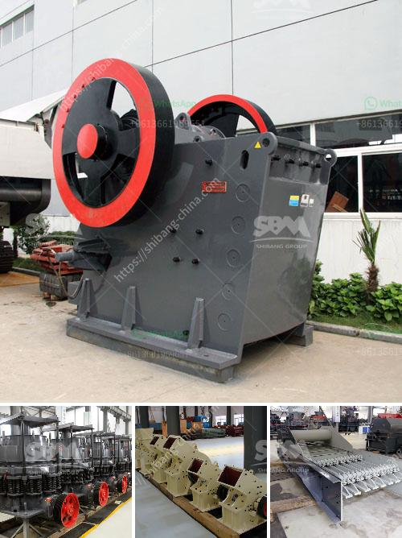

<h3>quarry stone plant</h3>
A quarry stone plant is a facility where various types of stones are extracted, processed, and manufactured into different sizes and shapes to be used in construction projects. These plants play a crucial role in meeting the ever-growing demands of infrastructure development.

Quarry stone plants are located in various regions around the world, where suitable rock formations are found. These locations are chosen based on the quality and quantity of the stone deposits. Materials commonly extracted from these plants include limestone, granite, sandstone, and marble, among others.

The extraction process begins with drilling and blasting, which are necessary to loosen and break the rock formations. Explosives are carefully placed at specific points to ensure the safe and efficient extraction of the stones. After the rocks are dislodged, they are loaded onto haul trucks and transported to the plant for processing.

At the quarry stone plant, the raw materials go through several stages of processing to transform them into construction materials. The primary process involves crushing and screening the rocks into various sizes. This is achieved using heavy machinery such as jaw crushers and vibrating screens. Different sizes of stone aggregates are produced to cater to different construction needs.

Once the stones are crushed and screened, they go through additional processes to enhance their quality. These processes may include washing, grading, and sorting the aggregates. Washing removes any impurities, such as dust or clay, present on the surface of the stones. Grading ensures that the aggregates meet the required size specifications, while sorting separates the stones based on their quality, color, or specific use.

Quarry stone plants also have facilities for manufacturing specialized construction materials. These may include crushed stone for road construction, concrete aggregates, asphalt aggregates, and manufactured sand. These materials are produced by blending different types of stones and carefully controlling the manufacturing process to meet the desired specifications.

The products manufactured in quarry stone plants are integral to the construction industry. They serve as the foundation for building roads, bridges, buildings, and other infrastructural projects. The durability and strength of these construction materials ensure that the structures built with them withstand the test of time.

Quarry stone plants have a significant impact on the local economy. They create employment opportunities, both directly and indirectly, by supporting various industries such as mining, transportation, and manufacturing. Moreover, these plants contribute to the growth and development of the region, attracting investments and driving construction activities.

Environmental sustainability is a critical consideration in modern quarry stone plants. Many of these facilities implement measures to minimize the impact on the surrounding ecosystem. Proper planning and reclamation techniques are employed to restore the land once the extraction processes are complete. Additionally, dust control measures and water management practices are implemented to mitigate any potential adverse effects on air and water quality.

In conclusion, quarry stone plants are vital hubs for extracting, processing, and manufacturing construction materials. These facilities ensure the availability of high-quality stones that are essential for the development of infrastructure projects. Moreover, they contribute to economic growth and implement environmentally sustainable practices. The quarry stone industry plays a crucial role in shaping our built environment and supporting the needs of modern society.
<h3>Contact us</h3><ul><li><strong>Whatsapp:&nbsp;<a href="https://wa.me/8613661969651">+8613661969651</a></strong></li><li><a href="https://swt.shibang-china.com/?git&amp;zhl&amp;quarry stone plant"><strong>Online Service(chat now)</strong></a></li></ul><h3>Related</h3><ul><li><a href='potential of mica wet grinding plant.md'>potential of mica wet grinding plant</a></li><li><a href='crusher on lease basis in nigeria.md'>crusher on lease basis in nigeria</a></li><li><a href='mobile screening plant.md'>mobile screening plant</a></li><li><a href='cost 100tpd cement plant india.md'>cost 100tpd cement plant india</a></li><li><a href='ballast crushing machine kenya.md'>ballast crushing machine kenya</a></li></ul>