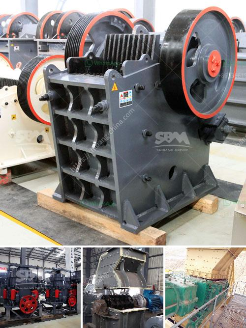

<h3>quartz bulk supplier sri lanka</h3>
Sri Lanka has emerged as a key player in the supply of quartz bulk, catering to the global demand for this versatile mineral. With its rich deposits and advanced mining techniques, the country has established itself as a reliable supplier in the international market.

Quartz, a mineral composed of silicon and oxygen atoms, is widely used in various industries such as electronics, construction, and manufacturing. Its unique properties, including high durability, heat resistance, and electrical conductivity, make it an essential component in a wide range of products and applications.

One of the major reasons why Sri Lanka has become a prominent supplier of quartz bulk is the presence of vast deposits of the mineral in the country. The quartz mines in Sri Lanka are known for their high-quality deposits, which are rich in purity and consistency. This ensures that customers receive a premium product that meets their specifications and quality standards.

Furthermore, the mining industry in Sri Lanka has embraced advanced techniques and technologies to extract quartz efficiently. This has significantly increased the productivity and competitiveness of quartz bulk suppliers in the country. The adoption of modern equipment and sustainable mining practices ensures the preservation of the environment and the welfare of local communities.

The quartz bulk suppliers in Sri Lanka cater to both domestic and international markets. They have a robust distribution network that enables them to meet the demands of customers worldwide. The country's strategic location and well-connected ports further facilitate the smooth export of quartz to various destinations across the globe.

In conclusion, the quartz bulk suppliers in Sri Lanka have solidified their position in the global market by capitalizing on the country's abundant quartz deposits and adopting advanced mining techniques. Their commitment to providing high-quality products, along with efficient distribution channels, has made them a reliable source for customers seeking quartz for various industrial applications. As the demand for quartz continues to grow, Sri Lanka is set to play an increasingly significant role in meeting the global requirements for this valuable mineral.
<h3>Contact us</h3><ul><li><strong>Whatsapp:&nbsp;<a href="https://wa.me/8613661969651">+8613661969651</a></strong></li><li><a href="https://swt.shibang-china.com/?git&amp;zhl&amp;quartz bulk supplier sri lanka"><strong>Online Service(chat now)</strong></a></li></ul><h3>Related</h3><ul><li><a href='mobile crusher tunisia.md'>mobile crusher tunisia</a></li><li><a href='processing plan for feldspar ore.md'>processing plan for feldspar ore</a></li><li><a href='sell jaw crusher.md'>sell jaw crusher</a></li><li><a href='kaolin manufacturing process.md'>kaolin manufacturing process</a></li><li><a href='quarry crusher plant in malaysia.md'>quarry crusher plant in malaysia</a></li></ul>