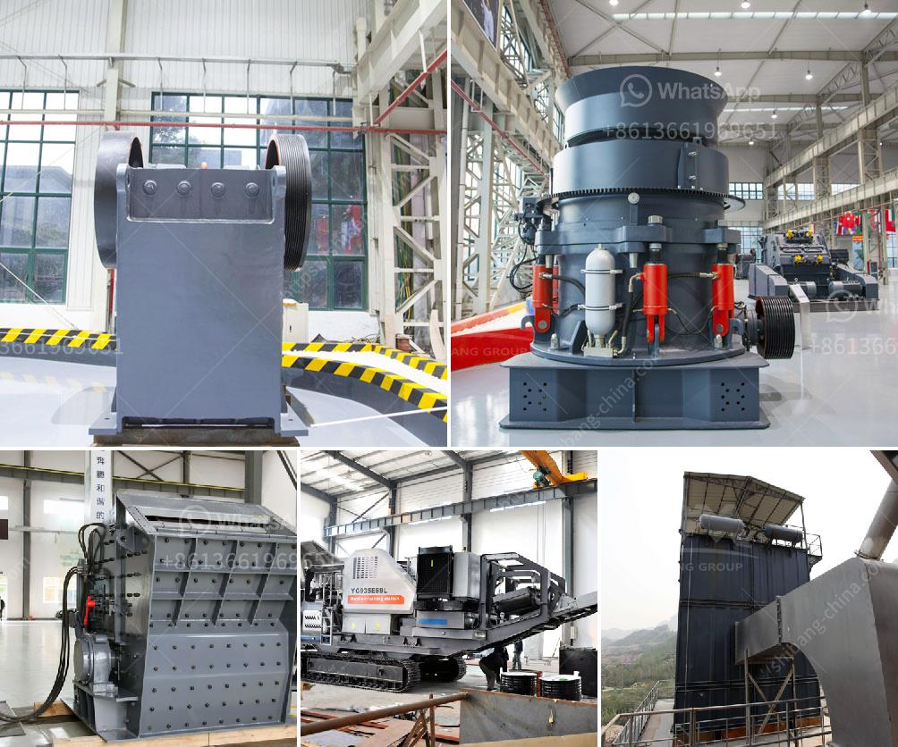

<h3>quartz crusher for sale</h3>
Quartz is a mineral that is commonly found in rocks. It is well-known for its hardness and durability, making it a popular material in various industries, including construction, mining, and manufacturing. In order to extract quartz, the ore must be crushed into smaller pieces, which is why a quartz crusher is essential for the process.

A quartz crusher is a machine that is used to crush quartz ore into smaller pieces to be used in various industries. As mentioned earlier, quartz is incredibly durable and hard, making it ideal for a variety of applications. Quartz can be used to make countertops, tiles, and even glass. Therefore, the demand for quartz has been steadily increasing over the years.

When looking for a quartz crusher for sale, there are a few important factors to consider. Firstly, the size of the quartz crusher is crucial. Depending on the desired output size, you will need to choose a machine that can handle the volume of quartz material you are working with. It is also important to consider the type of crushing mechanism the machine uses. There are various types of crushers available, including jaw crushers, cone crushers, and impact crushers. Each type has its own advantages and disadvantages, so it is important to choose the one that best suits your needs.

Another important factor to consider when purchasing a quartz crusher is the quality of the machine. You want a crusher that is built to last and can handle the demanding conditions of the quartz crushing process. It is advisable to choose a crusher from a reputable manufacturer with a good track record in the industry. This will ensure that you are getting a high-quality machine that will not break down easily.

Price is also a crucial factor when considering a quartz crusher for sale. While it is important to stay within your budget, it is equally important to remember that quality comes at a price. Therefore, it is advisable to avoid extremely cheap machines, as they may not be durable or efficient enough to meet your needs. It is better to invest in a slightly more expensive crusher that is reliable and can provide you with the necessary output.

In conclusion, a quartz crusher is essential for anyone involved in the extraction or processing of quartz. It is a durable and hard mineral that is in high demand across various industries. When purchasing a quartz crusher for sale, it is important to consider factors such as size, type, quality, and price. By doing so, you can ensure that you are getting a machine that meets your requirements and will provide you with efficient and reliable crushing capabilities for your quartz processing needs.
<h3>Contact us</h3><ul><li><strong>Whatsapp:&nbsp;<a href="https://wa.me/8613661969651">+8613661969651</a></strong></li><li><a href="https://swt.shibang-china.com/?git&amp;zhl&amp;quartz crusher for sale"><strong>Online Service(chat now)</strong></a></li></ul><h3>Related</h3><ul><li><a href='aggregate jaw crusher price.md'>aggregate jaw crusher price</a></li><li><a href='industrial gypsum rotary kiln.md'>industrial gypsum rotary kiln</a></li><li><a href='how to start stone crusher project.md'>how to start stone crusher project</a></li><li><a href='conveyor belts for shelves.md'>conveyor belts for shelves</a></li><li><a href='standard operating procedure of ball mill.md'>standard operating procedure of ball mill</a></li></ul>