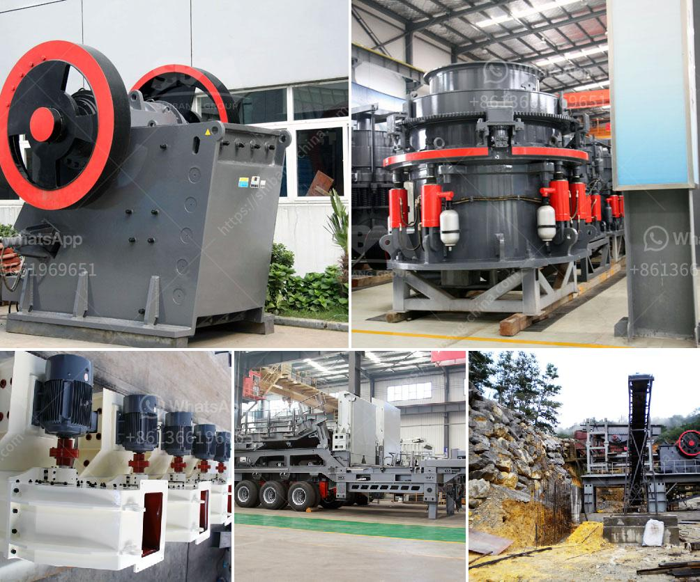

<h3>quartz crushing machine</h3>
Quartz, also known as silica, is one of the most common minerals on earth. It can be found in large quantities in igneous, metamorphic, and sedimentary rocks. Quartz is a general term used to describe a specific crystalline form of silicon dioxide (SiO2) that is translucent or transparent in its purest form. It has a high resistance to abrasion, electricity, and heat, making it an extremely valuable material in various industries.

Quartz crushing machines are used in a variety of industries such as mining, metallurgy, glass, ceramics, and building materials. Despite their different uses, the crushing process follows the same basic principles. First, quartz rocks are loaded into the crushing machine’s hopper. They are then fed into the machine’s chamber through a vibrating feeder. The chamber is lined with a wear-resistant material to prevent damage to the crushing machine.

Once the quartz rocks enter the chamber, they are crushed and broken into smaller pieces. This is achieved by the machine’s rotating blades or hammers, which strike the rocks with high velocity. The force of the impact breaks the rocks into smaller fragments, reducing their size and making them easier to process further. Some crushing machines also incorporate a grinding mechanism to further refine the crushed quartz.

One of the primary advantages of using quartz crushing machines is their reliability. These machines are built to withstand the harsh conditions of industrial environments and are designed to operate continuously without any breakdown or failure. This ensures a consistent supply of crushed quartz, which is crucial for the production processes in various industries.

Another benefit of quartz crushing machines is their efficiency. These machines are specifically designed to maximize the production of high-quality crushed quartz while minimizing energy consumption. They use advanced technologies and innovative designs to achieve optimal performance and reduce operating costs.

Quartz crushing machines are also versatile in their applications. Apart from crushing quartz rocks, they can also be used to crush other materials such as limestone, granite, or basalt. In addition, they can be used in various stages of the crushing process, from primary crushing to secondary and tertiary crushing.

As with any industrial equipment, proper maintenance and regular servicing are essential to ensure the longevity and optimal performance of quartz crushing machines. Routine inspections, lubrication, and replacement of worn-out parts are necessary to prevent breakdowns and maintain efficiency.

In conclusion, quartz crushing machines play a vital role in various industries by facilitating the processing of quartz rocks into smaller and more manageable sizes. They offer reliability, efficiency, and versatility, helping to maximize production output and reduce operating costs. However, proper maintenance and regular servicing are crucial to ensure the machines' longevity and optimal performance. With continued technological advancements, the future of quartz crushing machines looks promising, delivering improved productivity and enhanced efficiency.
<h3>Contact us</h3><ul><li><strong>Whatsapp:&nbsp;<a href="https://wa.me/8613661969651">+8613661969651</a></strong></li><li><a href="https://swt.shibang-china.com/?git&amp;zhl&amp;quartz crushing machine"><strong>Online Service(chat now)</strong></a></li></ul><h3>Related</h3><ul><li><a href='grinding of calcined gypsum.md'>grinding of calcined gypsum</a></li><li><a href='crusher on lease basis in nigeria.md'>crusher on lease basis in nigeria</a></li><li><a href='how to make clay powder machine.md'>how to make clay powder machine</a></li><li><a href='raymond mills mexico.md'>raymond mills mexico</a></li><li><a href='copper ore ball mill torky.md'>copper ore ball mill torky</a></li></ul>