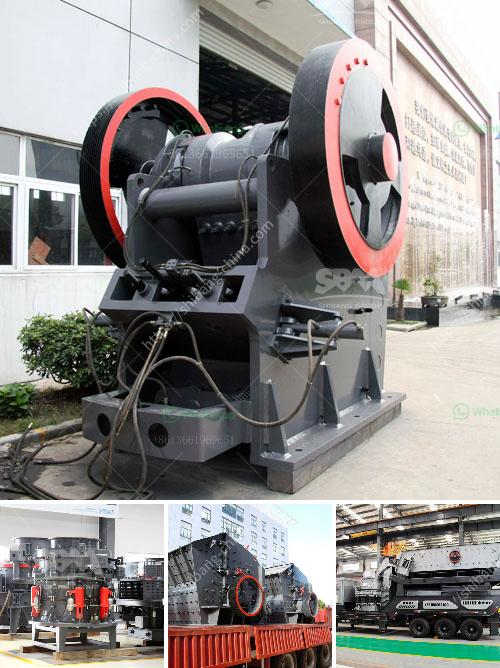

<h3>quartz crushing plant for engineered stone</h3>
Engineered stone, also known as quartz composite or simply quartz, has gained immense popularity in the construction industry due to its durability, flexibility, and aesthetic appeal. This man-made stone is composed of natural quartz crystals combined with resin and other materials, resulting in a product that mimics the beauty of natural stone without the drawbacks.

To meet the increasing demand for engineered stone, quartz crushing plants have become essential facilities in the production process. Here, we explore the significance and benefits of a quartz crushing plant for the production of engineered stone.

Quartz crushing plants are designed to handle the primary crushing of Quartz raw materials efficiently and economically. Usually configured as a key equipment in the processing line, these plants have a big impact on the overall productivity, cost-effectiveness, and quality of the final product.

The quartz crushing plant employs state-of-the-art machinery and equipment to ensure optimum efficiency and consistent quality. Jaw crushers, cone crushers, and impact crushers are all utilized in different stages of the crushing process. Each stage of crushing produces smaller particle sizes to facilitate the next stage and ultimately achieve the desired product size.

One of the most crucial aspects of a quartz crushing plant is the selection of the right crushing equipment for the job. Depending on the hardness of the quartz material, different types of crushers are required to achieve the desired particle size. Cone crushers are commonly used for secondary and tertiary crushing stages, while jaw crushers are ideal for primary crushing.

The crushing process in a quartz crushing plant involves multiple stages designed to generate a uniform particle size distribution. From blasting through to the crushing process, each stage must be optimally designed and executed to ensure the best outcome.

Apart from enhancing the overall efficiency and quality of the final product, quartz crushing plants contribute to sustainable construction practices. Unlike natural stone extraction, which often leads to significant environmental damage and depletion of resources, engineered stone production relies on quartz crushing plants that utilize recycled materials and environmentally friendly processes.

In addition, engineered stone provides an eco-friendly alternative to natural stone. Its non-porous nature reduces the risk of mold and bacterial growth, making it more hygienic. Moreover, engineered stone is highly resistant to stains, scratches, and heat, resulting in reduced maintenance costs and prolonging the lifespan of buildings and construction projects.

Quartz crushing plants play a crucial role in providing sustainable construction solutions. By utilizing recycled materials and reducing the environmental impact associated with natural stone extraction, these plants enable the production of a durable, visually appealing, and Earth-friendly building material.

Overall, quartz crushing plants are vital components of the engineered stone production process. They ensure the production of high-quality materials, contribute to sustainable construction practices, and enable the creation of visually striking architectural designs. As the demand for engineered stone continues to rise, investing in efficient quartz crushing plants is essential to meet the needs of the construction industry's evolving landscape.
<h3>Contact us</h3><ul><li><strong>Whatsapp:&nbsp;<a href="https://wa.me/8613661969651">+8613661969651</a></strong></li><li><a href="https://swt.shibang-china.com/?git&amp;zhl&amp;quartz crushing plant for engineered stone"><strong>Online Service(chat now)</strong></a></li></ul><h3>Related</h3><ul><li><a href='concrete grinding machine rental hk.md'>concrete grinding machine rental hk</a></li><li><a href='track mounted mobile crusher plant.md'>track mounted mobile crusher plant</a></li><li><a href='small crushing machines for gold.md'>small crushing machines for gold</a></li><li><a href='cement boll mill grinding media charging formula.md'>cement boll mill grinding media charging formula</a></li><li><a href='silica sand washing.md'>silica sand washing</a></li></ul>