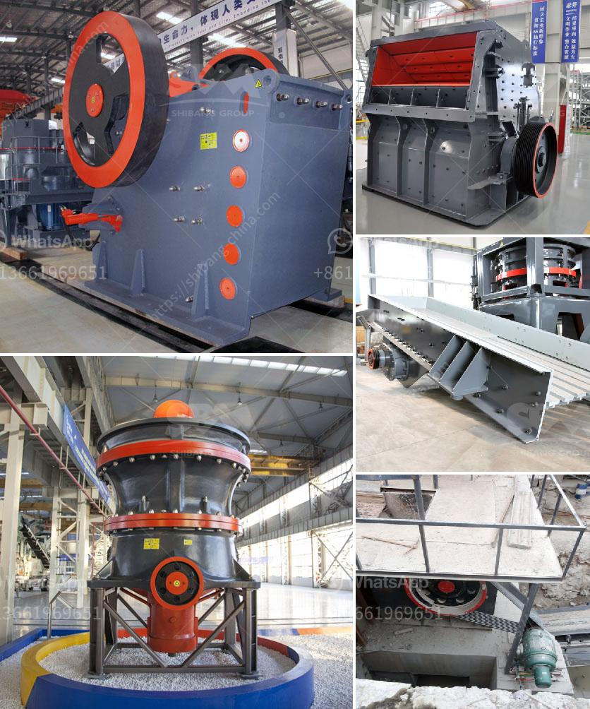

<h3>quartz grinding machine</h3>
Quartz is a mineral that is found abundantly in the Earth's crust. It is a type of crystalline silica that consists of silicon dioxide molecules. Quartz is one of the hardest minerals known to man and has a Mohs hardness of 7, which means it can easily scratch glass and other materials. Due to its hardness, quartz is often used in various industries, such as glass making, ceramics, and electronics.

To be used in these industries, quartz needs to be processed into fine powder. This is where a quartz grinding machine comes in. A quartz grinding machine is used to grind and polish quartz crystals or silica sand to make them into fine powder. These powders can be used in various applications such as glass making, ceramic tiles, pottery, and engineered stone manufacturing.

Quartz grinding machines have different types, one is a vertical grinding machine, which uses vertical grinding discs to grind quartz crystals or silica sand into fine powder. The other is a horizontal grinding machine, which uses horizontal grinding discs to achieve the same result. Different types of grinding machines have different grinding capacities and efficiency.

One popular quartz grinding machine is the HGM series ultrafine grinding machine. This machine is often used in quartz grinding circuits due to its high grinding efficiency, low power consumption, and small footprint. It produces a consistent and uniform product size, which is essential for high-quality quartz powders.

The HGM series ultrafine grinding machine consists of a main unit, a classifier, a blower, a finished product cyclone collector, a bag filter, and a connecting duct. The quartz crystals or silica sand are fed into the main unit through a vibrating feeder. The material is then ground by the grinding discs inside the main unit, and the fine powder is classified by the classifier. The classified powder is then collected by the cyclone collector and the bag filter.

One of the advantages of using a quartz grinding machine is that it can achieve a high grinding efficiency. The grinding discs inside the machine are made of high-quality materials, such as hard alloy, which can grind quartz crystals or silica sand with minimal energy consumption. The use of a classifier also helps to control the particle size distribution of the final product, ensuring a consistent and uniform powder.

Furthermore, a quartz grinding machine also has a small footprint, making it suitable for small and medium-sized quartz grinding operations. The machine is also easy to operate and maintain, requiring minimal training and maintenance. This makes it a cost-effective solution for quartz grinding.

In conclusion, a quartz grinding machine is essential in the quartz manufacturing industry. It grinds quartz crystals or silica sand into fine powder, which can be used in various applications. The machine offers high grinding efficiency, low power consumption, and a small footprint. It is easy to operate and maintain, making it a cost-effective solution for quartz grinding operations.
<h3>Contact us</h3><ul><li><strong>Whatsapp:&nbsp;<a href="https://wa.me/8613661969651">+8613661969651</a></strong></li><li><a href="https://swt.shibang-china.com/?git&amp;zhl&amp;quartz grinding machine"><strong>Online Service(chat now)</strong></a></li></ul><h3>Related</h3><ul><li><a href='cement plant operations handbook.md'>cement plant operations handbook</a></li><li><a href='what is the best granite crusher machine.md'>what is the best granite crusher machine</a></li><li><a href='manufacturer of industrial hammer mill.md'>manufacturer of industrial hammer mill</a></li><li><a href='decibels generated by hebro jaw crusher.md'>decibels generated by hebro jaw crusher</a></li><li><a href='100 tpd kiln project cost.md'>100 tpd kiln project cost</a></li></ul>