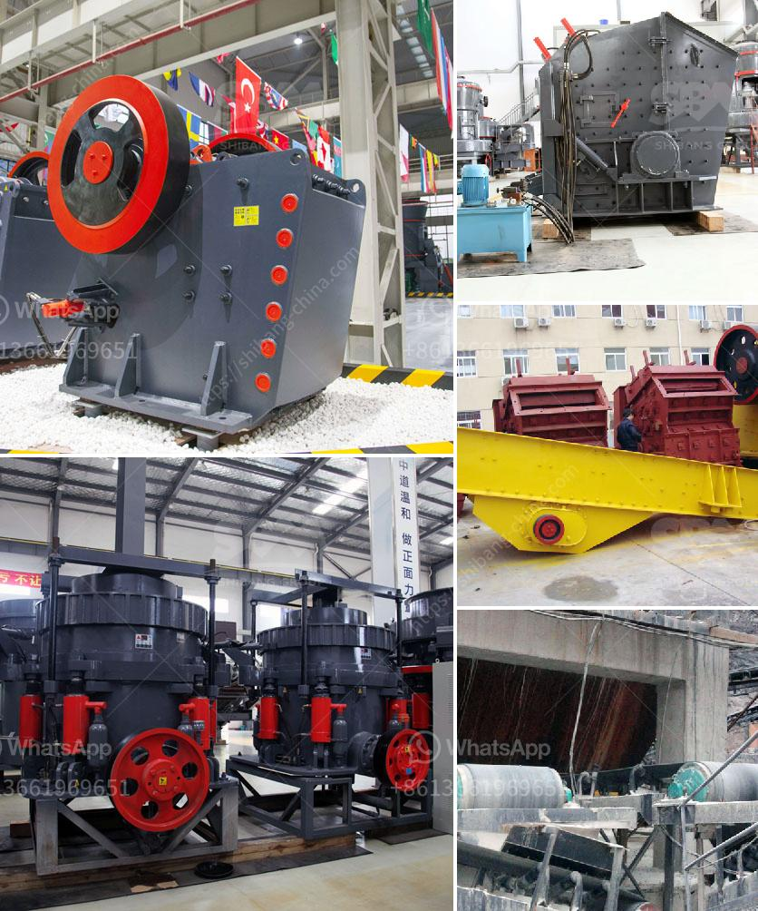

<h3>quartz grinding mill</h3>
Quartz is a mineral resource with exceedingly wide applications. It is found abundantly in the earth's crust and is used in various industries such as glass, ceramics, electronics, and even in the production of solar panels. However, before it can be used in these industries, it needs to undergo the grinding process to become a fine powder. This is where the quartz grinding mill comes into play.

The quartz grinding mill is a high-efficiency grinding equipment developed and produced by our company. It has a wide range of applications, including cement, silicate products, new building materials, refractory materials, fertilizers, various ores, glass ceramics, etc.

The quartz grinding mill can be customized according to customer needs. From 0.063mm (200 mesh) to 0.033mm (425 mesh), it can meet the grinding requirements of different fineness levels. The main components of the quartz grinding mill include a main engine, a reducer, an analysis machine, a pipeline device, a blower, and an electric control system.

One of the key advantages of the quartz grinding mill is its low energy consumption. It uses a unique grinding principle to achieve high-efficiency grinding while saving electricity. The grinding roller is tightly pressed on the grinding ring under the action of the centrifugal force, so as to achieve the purpose of grinding. The ground material is blown into the analysis machine for sorting, and the unqualified fine powder falls into the grinding chamber for regrinding. The fineness of the final product can be adjusted by adjusting the rotational speed of the analyzer.

In summary, the quartz grinding mill is a necessary equipment for grinding quartz, which directly affects the quality and application value of quartz powder. It has the characteristics of stable performance, high grinding efficiency, low energy consumption, and low investment cost. With the continuous improvement and development of technology, the quartz grinding mill will play an increasingly important role in various industries.
<h3>Contact us</h3><ul><li><strong>Whatsapp:&nbsp;<a href="https://wa.me/8613661969651">+8613661969651</a></strong></li><li><a href="https://swt.shibang-china.com/?git&amp;zhl&amp;quartz grinding mill"><strong>Online Service(chat now)</strong></a></li></ul><h3>Related</h3><ul><li><a href='ballast crushing machine kenya.md'>ballast crushing machine kenya</a></li><li><a href='stone crusher details.md'>stone crusher details</a></li><li><a href='crushing machine manufacturers.md'>crushing machine manufacturers</a></li><li><a href='concrete grinding machine rental hk.md'>concrete grinding machine rental hk</a></li><li><a href='bentonite processing plant alibaba.md'>bentonite processing plant alibaba</a></li></ul>