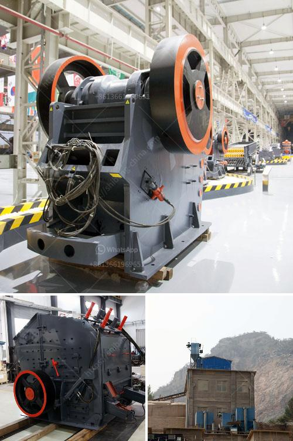

<h3>quartz manufacturing process</h3>
Quartz is a highly versatile material that is used in a wide range of industries, from electronics to construction. Its unique properties, such as its hardness, high melting point, and resistance to chemical and thermal shock, make it an ideal material for various applications. But have you ever wondered how quartz is manufactured?

The manufacturing process of quartz involves several steps, each aimed at creating the perfect composition and forming the desired shape. Firstly, the raw materials, which include silica sand and certain additives, are mixed together in a specialized mixer. This mixture is then poured into a mold that matches the desired shape of the final product.

The next step in the manufacturing process is the heating phase. The mold filled with the mixture is placed inside a high-temperature furnace. At temperatures reaching up to 2000 degrees Celsius, the mixture undergoes a process called vitrification. During this process, the particles of silica sand melt and fuse together, creating a solid mass.

After the heating process is complete, the mold is removed from the furnace and allowed to cool. Once the quartz has cooled, it undergoes a process called annealing. This process helps to relieve any internal stress within the quartz, making it stronger and more durable.

The final step in the manufacturing process is the polishing phase. The quartz product is carefully polished to achieve a smooth and shiny surface. This is done by using specialized machinery that gradually grinds and polishes the surface until the desired finish is achieved.

The manufacturing process of quartz is a delicate and precise one, requiring strict quality control and expert craftsmanship. The resulting quartz products are used in a variety of industries, such as the production of electronic components, kitchen countertops, and even in the manufacturing of high-end watches. Thanks to its unique properties and the intricate manufacturing process, quartz continues to be a highly sought-after material in numerous applications.
<h3>Contact us</h3><ul><li><strong>Whatsapp:&nbsp;<a href="https://wa.me/8613661969651">+8613661969651</a></strong></li><li><a href="https://swt.shibang-china.com/?git&amp;zhl&amp;quartz manufacturing process"><strong>Online Service(chat now)</strong></a></li></ul><h3>Related</h3><ul><li><a href='mobile crusher italy.md'>mobile crusher italy</a></li><li><a href='project report on quartz crusher industries.md'>project report on quartz crusher industries</a></li><li><a href='business plan on manganese ore mining.md'>business plan on manganese ore mining</a></li><li><a href='germany rocks crushers.md'>germany rocks crushers</a></li><li><a href='stone dust making machine.md'>stone dust making machine</a></li></ul>