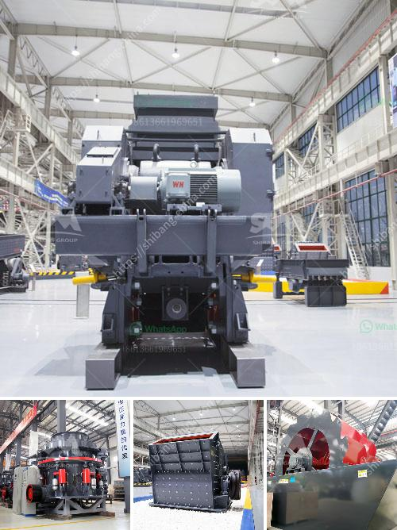

<h3>quartz mining equipments</h3>
Quartz is one of the most abundant minerals found in the Earth's crust. It has a wide range of industrial applications, making it highly sought after. Quartz mining involves extracting minerals from quartz veins that are embedded deep within the earth. To facilitate this process, specialized and efficient mining equipment is required. These mining equipments are designed to extract quartz with minimal damage to surrounding areas and ensure maximum productivity.

One of the key components of quartz mining equipment is the crusher. This machine is used to crush quartz rocks into smaller particles, making it easier for subsequent processing. Crushers come in various sizes, ranging from small handheld ones to large industrial machines. They operate using force, applying pressure to break down the rocks into smaller, more manageable sizes.

Once the quartz rocks are crushed, they need to be further processed to separate the valuable minerals from the waste material. This is where separation equipment comes into play. High-intensity magnetic separators are commonly used in quartz mining to separate magnetic minerals from non-magnetic ones. These separators use strong magnetic fields to attract and separate the minerals based on their magnetic properties.

In addition to separation equipment, quartz mining also requires heavy machinery for transportation and excavation. Bulldozers and front-end loaders are commonly used to remove the overburden – the layer of soil or rock covering the quartz veins. These machines are highly efficient and can move large amounts of material, allowing for faster and more efficient mining operations.

Quartz mining equipment is continually evolving to meet the demands of the industry. New technologies and innovations are regularly introduced to improve efficiency and reduce environmental impact. For example, advanced automation systems are being implemented to streamline operations and reduce human error.

In conclusion, quartz mining equipment plays a vital role in extracting valuable minerals from quartz veins. Crushers, separation equipment, and heavy machinery are essential components in this extraction process. As technology continues to advance, we can expect to see further improvements in efficiency and sustainability in quartz mining operations.
<h3>Contact us</h3><ul><li><strong>Whatsapp:&nbsp;<a href="https://wa.me/8613661969651">+8613661969651</a></strong></li><li><a href="https://swt.shibang-china.com/?git&amp;zhl&amp;quartz mining equipments"><strong>Online Service(chat now)</strong></a></li></ul><h3>Related</h3><ul><li><a href='gypsum board making machine supplier.md'>gypsum board making machine supplier</a></li><li><a href='aggregate jaw crusher price.md'>aggregate jaw crusher price</a></li><li><a href='open cast mining china clay process.md'>open cast mining china clay process</a></li><li><a href='malaysia conveyor belts price.md'>malaysia conveyor belts price</a></li><li><a href='german zenith made mobile stone crusher.md'>german zenith made mobile stone crusher</a></li></ul>