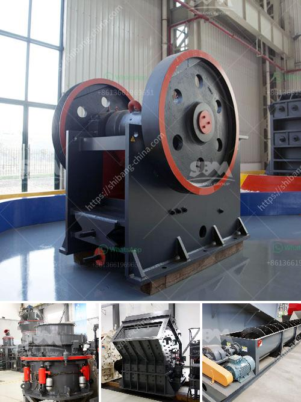

<h3>quartz plant and machinary</h3>
Quartz is a naturally occurring mineral that is highly abundant in the earth's crust. It is composed of silicon and oxygen atoms arranged in a continuous framework of SiO4 silicon-oxygen tetrahedra. Quartz possesses numerous valuable properties, including its hardness, transparency, and resistance to chemical weathering. As a result, this mineral has found widespread use in various industries, particularly in the manufacturing of quartz plants and machinery.

A quartz plant refers to a facility dedicated to processing quartz minerals. These plants are equipped with advanced machinery and technology to extract, refine, and process quartz into various forms suitable for different applications. The primary objective of a quartz plant is to transform raw quartz into value-added products that cater to the specific requirements of industries like electronics, ceramics, glass, and construction.

The machinery used in a quartz plant plays a crucial role in the extraction and refining processes. One of the essential machines in a quartz plant is the crusher. This machine is responsible for breaking down the raw quartz into smaller, more manageable pieces. The crusher can come in different types, such as jaw crushers, cone crushers, or impact crushers, depending on the desired output size and shape.

Once the quartz is broken down, further processing is required to eliminate impurities and enhance its quality. A crucial piece of machinery in this stage is the vibrating screen. The vibrating screen separates the quartz particles based on size, ensuring that only the desired sizes proceed to the next step. This step is vital because different industries require quartz with specific size specifications for their products.

After the vibrating screen, another important machine in a quartz plant is the magnetic separator. This device utilizes magnetic properties to separate any remaining impurities from the quartz. By passing the material through a magnetic field, the magnetic separator attracts and removes metallic particles or other contaminants, resulting in a purer end product.

The final steps in a quartz plant involve refining and shaping the quartz into the desired form. Various machines, including grinding mills and polishing machines, are employed to achieve this. Grinding mills finely grind the quartz particles to produce powders of different particle sizes. These powders are utilized in various industries, such as electronics and ceramics, for their unique properties.

On the other hand, polishing machines are used to give the quartz surfaces a smooth, glossy finish. This is particularly crucial in the production of quartz slabs or countertops, where aesthetics are of utmost importance. Polishing machines utilize abrasive pads or wheels to grind and buff the surface, resulting in a mirror-like appearance.

In conclusion, quartz plants and machinery are essential in extracting, refining, and processing quartz minerals for various industries. The machinery used in a quartz plant, including crushers, vibrating screens, magnetic separators, grinding mills, and polishing machines, perform specific functions to transform raw quartz into valuable end products. With the advanced technology and machinery available today, the quartz industry continues to thrive and provide materials that contribute to an array of applications.
<h3>Contact us</h3><ul><li><strong>Whatsapp:&nbsp;<a href="https://wa.me/8613661969651">+8613661969651</a></strong></li><li><a href="https://swt.shibang-china.com/?git&amp;zhl&amp;quartz plant and machinary"><strong>Online Service(chat now)</strong></a></li></ul><h3>Related</h3><ul><li><a href='quotes hammer mill.md'>quotes hammer mill</a></li><li><a href='ball mill grinder for sale.md'>ball mill grinder for sale</a></li><li><a href='porur raymond grinding mill.md'>porur raymond grinding mill</a></li><li><a href='copper concentrate ball mill for sale.md'>copper concentrate ball mill for sale</a></li><li><a href='artificial sand project.md'>artificial sand project</a></li></ul>