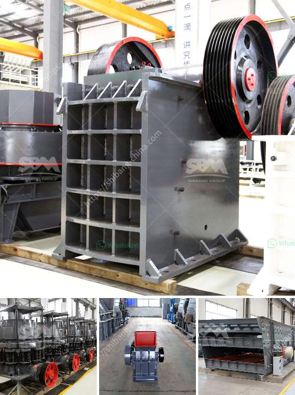

<h3>quartz powder manufacturers in india</h3>
Quartz powder is a fundamental raw material used in various industries across the globe. It is primarily used in the production of glass, ceramics, and abrasives. India has emerged as one of the major quartz powder manufacturers, catering to the increasing demand both domestically and internationally. This article aims to shed light on the quartz powder manufacturers in India and their contribution to the industry.

India is blessed with abundant quartz reserves, making it one of the largest producers of quartz powder in the world. The country's vast geological resources, coupled with advanced mining techniques, have made India a preferred destination for quartz powder manufacturers. The states of Rajasthan, Andhra Pradesh, Tamil Nadu, and Gujarat account for the majority of quartz production in India.

One of the leading quartz powder manufacturers in India is Palash Minerals. With a strong foothold in the industry for over two decades, Palash Minerals has carved a niche for itself. The company maintains a state-of-the-art manufacturing unit equipped with advanced machinery and technologies to deliver high-quality quartz powder. It offers a wide range of quartz products for various applications, meeting the diverse requirements of customers.

Rajasthan is considered the hub of quartz powder manufacturing in India. It is home to numerous quartz powder manufacturers, contributing significantly to the country's economy. These manufacturers extract quartz from mines and process it into fine powder through crushing, grinding, and sieving processes. The end result is a pure and granular quartz powder that can be used for a wide range of applications.

Apart from Palash Minerals, other prominent quartz powder manufacturers in India include Adinath Industries, Harison Minerals & Allied Industries, and Quartz India. These companies have established their brand reputation by consistently delivering superior-quality quartz powder and meeting the industry's stringent standards.

India's quartz powder manufacturers not only cater to the domestic market but also export to various countries worldwide. The growing demand for quartz powder in industries such as glass, ceramics, and abrasives has opened up opportunities for Indian manufacturers to expand their global footprint. The competitive pricing and high-quality standards maintained by these manufacturers have made India a preferred choice for quartz powder importers.

Furthermore, the growing trend of sustainability and eco-friendly practices has prompted quartz powder manufacturers in India to adopt measures to minimize their environmental impact. Many manufacturers ensure responsible mining and employ advanced processing techniques to reduce energy consumption and waste generation. This commitment to sustainability has further enhanced their reputation in the industry.

In conclusion, India's status as one of the leading quartz powder manufacturers underscores its potential and contribution to the global market. The abundance of quartz reserves, coupled with advanced mining and processing techniques, has made India a preferred choice for quartz powder sourcing. With a focus on quality, sustainability, and meeting customer requirements, Indian manufacturers are poised to play a significant role in the quartz powder industry for years to come.
<h3>Contact us</h3><ul><li><strong>Whatsapp:&nbsp;<a href="https://wa.me/8613661969651">+8613661969651</a></strong></li><li><a href="https://swt.shibang-china.com/?git&amp;zhl&amp;quartz powder manufacturers in india"><strong>Online Service(chat now)</strong></a></li></ul><h3>Related</h3><ul><li><a href='alluvial gold mining process.md'>alluvial gold mining process</a></li><li><a href='limestone ore concentration plant.md'>limestone ore concentration plant</a></li><li><a href='price of stone crusher capacity 200 tons per hour.md'>price of stone crusher capacity 200 tons per hour</a></li><li><a href='impact crusher supplier.md'>impact crusher supplier</a></li><li><a href='grinder mill specification.md'>grinder mill specification</a></li></ul>