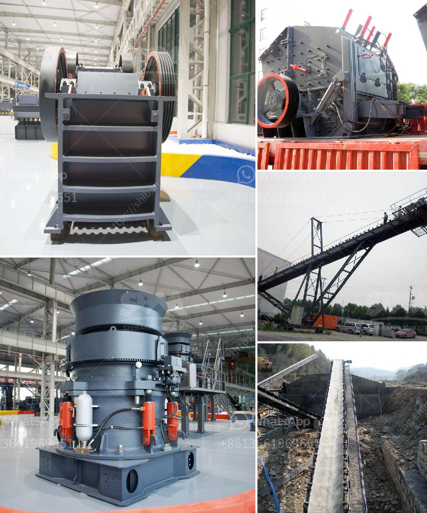

<h3>quartz powder plant nigeria</h3>
Quartz is a pure, naturally occurring mineral that exists in abundance all over the world. It is commonly used in various industries, including glass manufacturing, ceramics, and electronics. Nigeria, as one of the largest countries in Africa, has significant deposits of quartz.

In recent years, the demand for quartz powder has been steadily rising, due to its wide range of applications. This has led to the establishment of quartz powder plants in various parts of Nigeria, including Kaduna, Ogun, and Kogi states.

One such plant, situated in Kaduna State, is playing a pivotal role in meeting the rising demand for quartz powder. This plant is equipped with state-of-the-art machinery and technology to extract quartz ore from the mines and process it into high-quality powder. The entire production process is carefully monitored to ensure consistent quality.

The quartz powder produced in this plant exhibits excellent purity and consistency, making it suitable for use in a wide range of industries. Glass manufacturers, for example, rely heavily on quartz powder as a main ingredient in their production process. The high purity of the quartz powder ensures the glass produced is clear, durable, and scratch-resistant.

Ceramics is another industry that benefits greatly from the availability of quartz powder. The powder is added to ceramic glazes and bodies to enhance strength and durability, as well as to achieve a glossy finish. Quartz powder also acts as a filler in rubber products, improving their hardness and resistance to wear and tear.

The electronics industry is yet another sector that relies on quartz powder for various applications. Quartz powder is used in the production of semiconductors, optical lenses, and precision instruments, due to its high thermal and chemical resistance. It is also used in the manufacturing of solar panels, as quartz is a key component of photovoltaic cells.

The establishment of quartz powder plants in Nigeria has not only ensured a steady supply of the mineral to domestic industries but has also opened up opportunities for employment and economic growth. These plants provide direct employment to local workers and also support related industries such as transportation and logistics.

Furthermore, the presence of quartz powder plants in Nigeria has reduced the country's reliance on imports and fostered self-sufficiency in meeting the demand for this valuable mineral. This has not only saved foreign exchange but has also contributed to the growth of the local economy.

In conclusion, the establishment of quartz powder plants in Nigeria has been a significant development for the country. These plants not only produce high-quality quartz powder but also contribute to the growth of various industries such as glass manufacturing, ceramics, and electronics. They have created employment opportunities and reduced dependency on imports, thereby boosting the local economy. With the increasing demand for quartz powder, Nigeria's quartz powder plants are poised to play an even bigger role in meeting the needs of both domestic and international markets.
<h3>Contact us</h3><ul><li><strong>Whatsapp:&nbsp;<a href="https://wa.me/8613661969651">+8613661969651</a></strong></li><li><a href="https://swt.shibang-china.com/?git&amp;zhl&amp;quartz powder plant nigeria"><strong>Online Service(chat now)</strong></a></li></ul><h3>Related</h3><ul><li><a href='50tph stone crusher in germany.md'>50tph stone crusher in germany</a></li><li><a href='small rock crusher portable gold mining.md'>small rock crusher portable gold mining</a></li><li><a href='difference between hp cone crusher.md'>difference between hp cone crusher</a></li><li><a href='floating processing mining plants.md'>floating processing mining plants</a></li><li><a href='iron ore crushing equipment in mexico.md'>iron ore crushing equipment in mexico</a></li></ul>