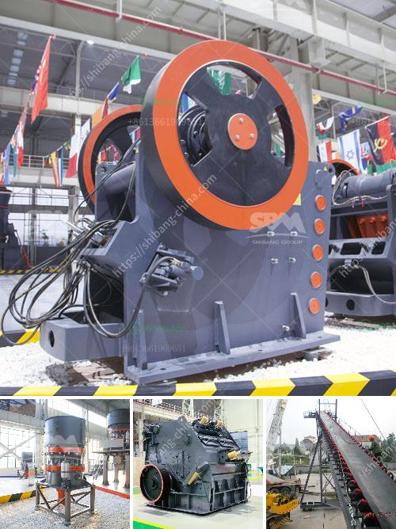

<h3>quartz silica old plant sale at telgana</h3>
Telangana, a state in southern India, is witnessing a significant development in the industrial sector. With the recent announcement of the sale of an old quartz silica plant, the region is set to attract new investments and stimulate economic growth. This move presents an exciting opportunity for investors to tap into the potential of the quartz silica market and contribute to Telangana's industrial advancement.

Quartz silica, also known as silicon dioxide, is a crucial raw material used in various industries such as glass manufacturing, ceramics, construction, and electronics. It is prized for its high resistance to heat and chemical reactions, making it an important component in the production of numerous consumer and industrial products. Given its wide-ranging applications, the demand for quartz silica has been steadily growing, making it an attractive market for investors.

The decision to sell an old quartz silica plant in Telangana comes as a strategic move by the government to revitalize the region's industrial landscape and promote economic growth. The plant, with its existing infrastructure and machinery, offers investors a cost-effective entry point into the quartz silica market. With the necessary refurbishments and modernizations, the plant holds the potential to become a thriving production hub in the state.

One of the key advantages of investing in an old plant is the reduced initial capital expenditure. The infrastructure and machinery are already in place, saving investors from the hefty costs associated with setting up a new plant. Additionally, the existing plant site in Telangana offers access to abundant raw materials, skilled labor, and a favorable business environment, further enhancing its appeal to potential investors.

Moreover, the sale of the old plant provides an opportunity for investors to contribute to sustainable development. By refurbishing and upgrading the existing infrastructure, investors can employ eco-friendly technologies and practices to minimize environmental impact. This aligns with the global trend of moving towards greener and more sustainable production methods, attracting environmentally conscious investors.

Furthermore, the sale of the old plant at Telangana not only benefits investors but also supports the local economy. It generates new employment opportunities for the local workforce, thereby uplifting the standard of living in the region. Additionally, the increased industrial activity can have a positive ripple effect on various sectors, such as logistics, transportation, and services, further driving economic growth.

To ensure the success of this venture, both the government and potential investors must collaborate closely. The government can offer incentives such as tax benefits, streamlined administrative processes, and infrastructure support to encourage investment in the plant. Additionally, providing a favorable policy framework and a transparent regulatory environment will instill confidence in investors and foster a positive business atmosphere.

In conclusion, the sale of an old quartz silica plant in Telangana presents an exciting opportunity for investors looking to capitalize on the growing demand for quartz silica. With its existing infrastructure, access to raw materials, and a favorable business environment, the plant holds immense potential for growth and profitability. Moreover, by refurbishing and upgrading the plant, investors can contribute to sustainable development and create new employment opportunities. As Telangana aims to become a prominent industrial destination, this move will undoubtedly propel the region's economic growth and establish it as a key player in the quartz silica market.
<h3>Contact us</h3><ul><li><strong>Whatsapp:&nbsp;<a href="https://wa.me/8613661969651">+8613661969651</a></strong></li><li><a href="https://swt.shibang-china.com/?git&amp;zhl&amp;quartz silica old plant sale at telgana"><strong>Online Service(chat now)</strong></a></li></ul><h3>Related</h3><ul><li><a href='technical specification for ball mill.md'>technical specification for ball mill</a></li><li><a href='crusher mandrel crusher price.md'>crusher mandrel crusher price</a></li><li><a href='cost of a silica crusher.md'>cost of a silica crusher</a></li><li><a href='gold ore processing nigeria.md'>gold ore processing nigeria</a></li><li><a href='fine grinding ball mills.md'>fine grinding ball mills</a></li></ul>