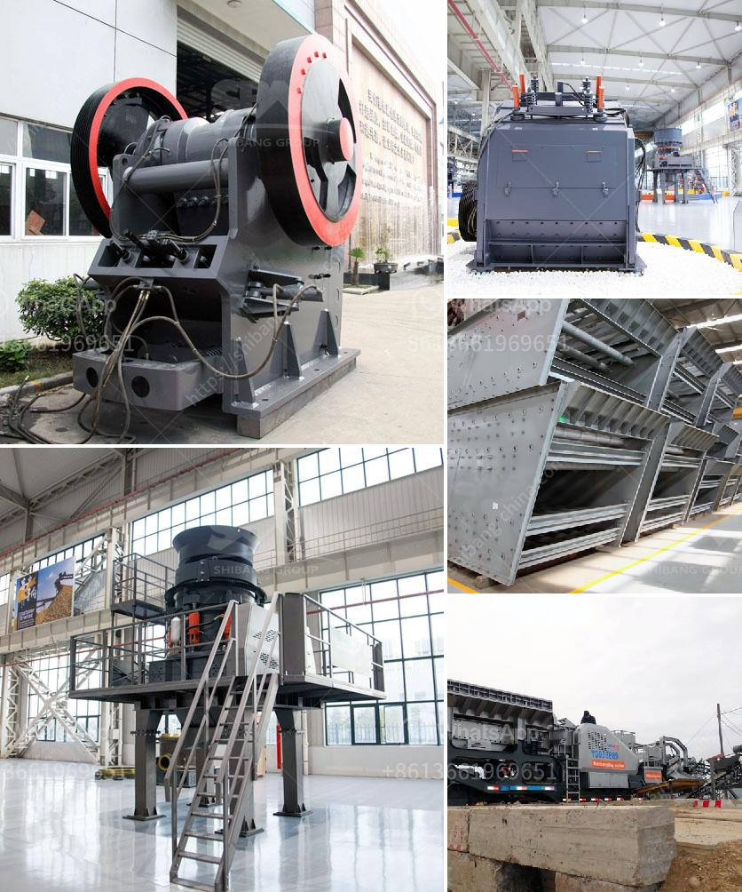

<h3>quartz stone crushing unit in india</h3>
India is a country that is rich in various minerals and resources. It is home to vast deposits of different minerals including quartz, one of the most popular and sought-after minerals in the world. Quartz is a crystalline form of silica, a common mineral found in many types of rocks. Quartz has a wide range of applications in various industries, including construction, ceramics, electronics, and more. 

The demand for quartz in India has been steadily increasing over the years, with the country being one of the largest consumers of quartz in the world. This is primarily due to the growth of the construction industry and the increasing use of quartz in manufacturing various products. 

To cater to the growing demand for quartz, many industries and units have been set up in India, particularly in the quartz-rich regions of Rajasthan, Gujarat, and Maharashtra. One such unit is the quartz stone crushing unit in India, which is specialized in producing quartz grits and dust. 

Different types of quartz, such as quartzite, rose quartz, and milky quartz, are extracted from mines in these regions. After extraction, the raw quartz is taken to the processing plant where it is crushed, washed, and dried to remove impurities. After the quartz is processed, it is then used in various industries such as glass manufacturing, ceramic production, and foundries. 

The quartz stone crushing unit has been established in the area where the State Government has allocated land on the basis of the availability of rocks, water resources, and other facilities. The unit will crush quartz stones into quartz grits of different sizes to be used in various applications, such as glass-making, construction, and ceramics manufacturing. 

The crushing unit is equipped with advanced machinery and equipment to ensure that the entire process is carried out with precision and accuracy. Specialized crushers, grinders, and screening machines are used to break down the quartz stones into smaller pieces and then further process them into grits. 

The quartz stone crushing unit in India is equipped with state-of-the-art facilities and technology to fulfill the demands of quartz grits and stone chips in numerous industries. Quartz grits are produced by crushing quartz stones and sieving them to the required grain sizes. The quartz grits are used for various applications in industries such as glass manufacturing, ceramics, construction, and more. 

The Indian quartz stone crushing unit aims to provide high-quality quartz grits to its customers and also to export some of its production to a wide range of international markets. As a result, the unit has been investing in the latest technology and machinery to ensure that competitiveness and meet the growing demands of both domestic and international markets. 

In conclusion, the quartz stone crushing unit in India is specialized in producing quartz grits and dust. The quartz stone crushing unit in India adopts advanced technology and innovative design to produce high-quality quartz grits and dust. The unit is located in the prime location of Rajasthan, which is rich in quartz mines and the stone-crushing industry in India has been growing rapidly due to increasing demand from the construction industry. Quartz grits and dust are widely used in ceramics, glass, and construction industries. So, it is a perfect opportunity for entrepreneurs to invest in this industry and earn a significant profit.
<h3>Contact us</h3><ul><li><strong>Whatsapp:&nbsp;<a href="https://wa.me/8613661969651">+8613661969651</a></strong></li><li><a href="https://swt.shibang-china.com/?git&amp;zhl&amp;quartz stone crushing unit in india"><strong>Online Service(chat now)</strong></a></li></ul><h3>Related</h3><ul><li><a href='raymond grinding mill machine.md'>raymond grinding mill machine</a></li><li><a href='flowsheet for crushing plant.md'>flowsheet for crushing plant</a></li><li><a href='salt processing plant machinery.md'>salt processing plant machinery</a></li><li><a href='jaw crusher specifications.md'>jaw crusher specifications</a></li><li><a href='tph granite crushing plant for sale.md'>tph granite crushing plant for sale</a></li></ul>