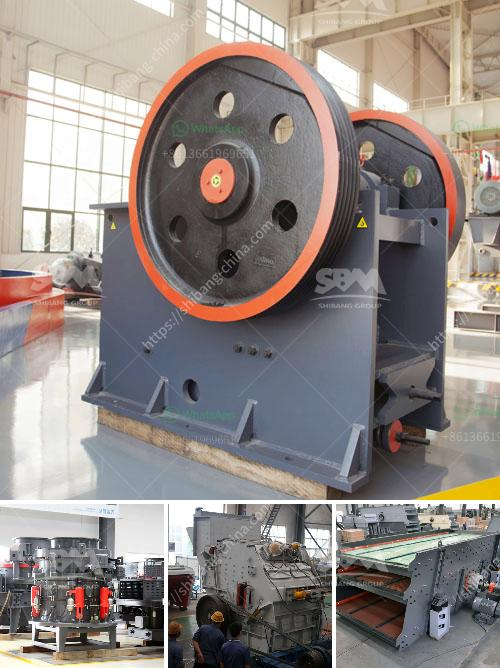

<h3>quartz stone making process</h3>
Quartz has become one of the most popular materials for countertops, flooring, and other applications due to its durability, beauty, and low maintenance requirements. But have you ever wondered how quartz stone is made? In this article, we will take you through the step-by-step process of creating quartz stone.

1. Raw Material Selection: The first step in the quartz stone-making process is selecting the right raw materials. High-quality quartz crystals are chosen as the primary ingredient, along with other minerals such as feldspar, resin, and pigments. These raw materials are carefully inspected to ensure they meet the desired quality standards.

2. Mixing: Once the raw materials are selected, they are mixed together using state-of-the-art machinery. The mixture is combined in precise proportions to achieve the desired color, texture, and pattern. This is a critical step as it determines the overall appearance of the quartz stone.

3. Molding: After the mixing process, the blended material is poured into molds. These molds are typically square or rectangular in shape, depending on the desired slab size. The mixture is spread evenly in the mold to ensure a uniform thickness throughout the slab.

4. Pressing: Once the mixture is poured into the molds, it needs to be compacted and pressed. This is done using a high-pressure vacuum and vibration system. The pressure exerted on the mixture ensures that any air bubbles are eliminated, resulting in a more durable and homogeneous slab.

5. Curing: After pressing, the slabs are placed in a curing oven, where they undergo a curing process. The temperature and duration of the curing process may vary depending on the specific material and manufacturer. This step allows the resin to harden and bind the quartz particles together, resulting in a strong and resilient surface.

6. Polishing: Once the slabs have been cured, they undergo a polishing process to enhance their appearance and smoothness. This involves grinding the surface of the slab using abrasive tools and progressively finer grits. The process removes any imperfections and brings out the natural shine of the quartz stone.

7. Quality Control: Throughout the manufacturing process, strict quality control measures are implemented to ensure that the finished product meets the desired standards. Slabs are inspected for any defects, such as cracks, chips, or discoloration. Only slabs that pass these rigorous inspections are considered for distribution and installation.

8. Cutting and Fabrication: After the slabs are polished and deemed suitable for use, they are cut into specific sizes and shapes using specialized saws and machinery. This allows them to be customized and tailored to fit different applications, such as countertops or tiles.

9. Packaging and Distribution: Finally, the finished quartz stone products are packaged and prepared for distribution. They are carefully wrapped and protected to prevent any damage during transportation. From there, they are shipped to distributors, suppliers, and ultimately made available to consumers for installation.

The quartz stone-making process is a highly sophisticated and intricate procedure, requiring advanced technology and skilled craftsmanship. Each step contributes to the creation of a beautiful and durable quartz surface that can enhance any space. So, the next time you admire a quartz countertop or flooring, you can appreciate the detailed and meticulous process behind its creation.
<h3>Contact us</h3><ul><li><strong>Whatsapp:&nbsp;<a href="https://wa.me/8613661969651">+8613661969651</a></strong></li><li><a href="https://swt.shibang-china.com/?git&amp;zhl&amp;quartz stone making process"><strong>Online Service(chat now)</strong></a></li></ul><h3>Related</h3><ul><li><a href='raymond mill manufacturers in india.md'>raymond mill manufacturers in india</a></li><li><a href='stone grinder machine for marble.md'>stone grinder machine for marble</a></li><li><a href='nigeria crusher suppliers.md'>nigeria crusher suppliers</a></li><li><a href='cost of coal washing plant.md'>cost of coal washing plant</a></li><li><a href='two pass roller mill.md'>two pass roller mill</a></li></ul>