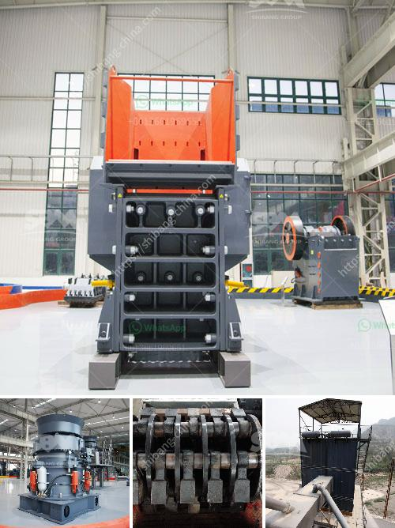

<h3>quotation for stone crusher</h3>
Stone crusher machine belongs to the mining equipment. Stone crusher has widely applications in mining industry, construction, metallurgy industry and so on. Crusher machines are mainly used for processing various ores and rocks.

For processing a kind of stones, there are some business plans to make a clear budget of stone crusher. Quotation for stone crusher machine in India includes vibrating feeder, jaw crusher, impact crusher, vibrating screen, belt conveyor and so on.

To get a detailed quotation, you can ask suppliers to provide readymade quotations. A reputable and reliable supplier can provide you with an affordable and competitive quotation. You can also get quotation from the manufacturer directly. They usually have a website where you can fill out some basic information about your project, such as material to be crushed, required capacity, input size, output size, etc. Based on these information, they will provide you with a detailed quotation.

The price of the stone crusher machine depends on many factors, such as the processing materials, capacity, power, required size of the finished product, etc. So, the cost of stone crusher plant is high or low?

To determine the quotation of the stone crusher machine, We should take various factors into consideration, such as size of the raw materials, required output size, production capacity, final products' requirement, etc. Generally speaking, the price of stone crusher machine is affected by these factors.

First of all, the type of stone crusher machine can be roughly divided into jaw crusher, impact crusher, cone crusher, etc. Each type of stone crusher has different specifications, capacity and price. So the quotation of a 200 tph stone crushing line includes different accessories.

Vibrating feeder, jaw crusher, impact crusher, vibrating screen, belt conveyor are main equipments that used for crushing the material into smaller ones. The vibrating feeder feeds the raw material into the jaw crusher, and the jaw crusher is used to crush the stone into smaller size. The finished product is sent to the vibrating screen, and the qualified ones are screened out to become final products. The unqualified ones are returned to the jaw crusher for crushing again. This process is repeated until all the raw materials are crushed into required size.

The capacity of the stone crusher machine depends on the feed size of the stone, the product size required, and the necessary motor power. Come to the professional stone crusher manufacturer and get a quotation now! You can find a reliable stone crusher supplier in India, and choose the one that suits you the best. They will provide you with the most suitable solution based on your needs and budget.

In conclusion, the quotation for stone crusher machine in India depends on many factors, such as the type of stone crusher, capacity, power, required size of the finished product, etc. If you want to get an accurate and detailed quotation, you can contact reputable suppliers or manufacturers directly and provide them with all the necessary information about your project. Based on these information, they will provide you with a reasonable quotation and help you choose the best stone crusher machine for your project.
<h3>Contact us</h3><ul><li><strong>Whatsapp:&nbsp;<a href="https://wa.me/8613661969651">+8613661969651</a></strong></li><li><a href="https://swt.shibang-china.com/?git&amp;zhl&amp;quotation for stone crusher"><strong>Online Service(chat now)</strong></a></li></ul><h3>Related</h3><ul><li><a href='grinder mill powder singapore.md'>grinder mill powder singapore</a></li><li><a href='distributor pulverizer crusher indonesia.md'>distributor pulverizer crusher indonesia</a></li><li><a href='river stone crusher plant for sale in india.md'>river stone crusher plant for sale in india</a></li><li><a href='aggregate crushers south africa.md'>aggregate crushers south africa</a></li><li><a href='quarry crusher equipments for sale in ibadan nigeria.md'>quarry crusher equipments for sale in ibadan nigeria</a></li></ul>