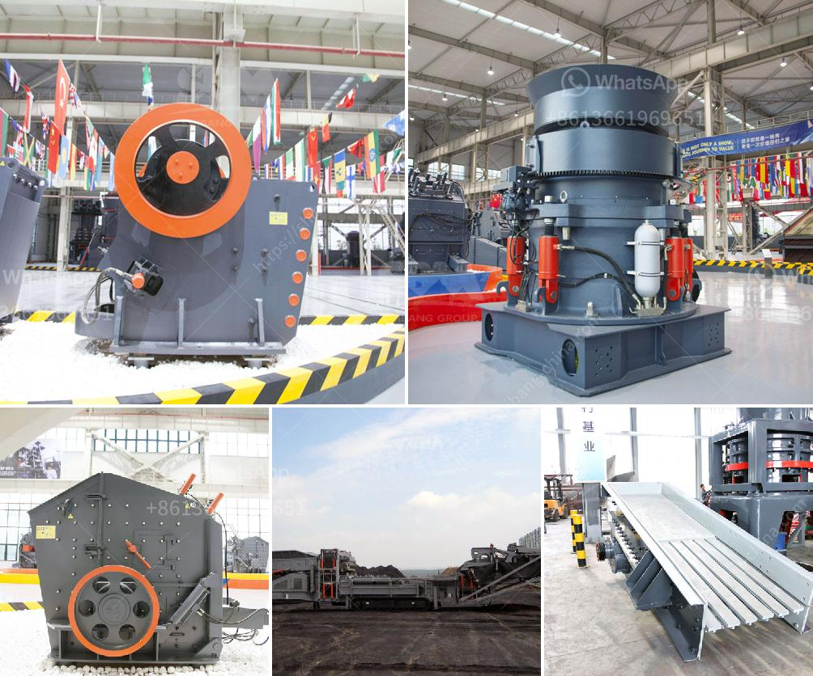

<h3>quote for hydraulic cone crusher</h3>
The hydraulic cone crusher is a widely used machine for secondary and fine crushing in the fields of mining, building materials, metallurgy, and so on. The successful combination of high-performance crushing cavity type and high crushing frequency has greatly improved the processing capacity of the machine. Due to its compact structure, convenient operation and maintenance, the hydraulic cone crusher has become the preferred choice for many crushing plants.

One of the key factors contributing to the popularity of hydraulic cone crushers is their efficiency in crushing various materials. The hydraulic system of the machine can adjust the discharging port, setting the appropriate particle size according to the needs of the customer. This allows for a wide range of applications, from finely crushed materials to coarse aggregates.

In addition, hydraulic cone crushers are equipped with several safety devices to ensure the safe operation of the machine. The hydraulic system can quickly discharge any non-crushable materials to prevent damage to the crusher. Moreover, the overload protection system allows the machine to automatically reset once the overload is relieved, avoiding the risk of machine breakdown.

Another significant advantage of hydraulic cone crushers is their low energy consumption. The advanced technology and optimized design reduce the power consumption of the machine, leading to lower operating costs for crushing plants. This makes hydraulic cone crushers an economical choice for many businesses.

When considering the purchase of a hydraulic cone crusher, many people might be concerned about the price. However, it is important to remember that "quality and price go hand in hand". A high-quality hydraulic cone crusher may have a higher price, but it also guarantees better performance and longer service life, which ultimately leads to higher productivity and profitability for users.

In conclusion, hydraulic cone crushers are highly efficient machines that offer numerous benefits for various crushing applications. With their advanced technology, safety features, low energy consumption, and high-quality construction, hydraulic cone crushers are a worthwhile investment for any crushing plant. As always, it is important to choose a reputable manufacturer and supplier to ensure the best results and value for money.
<h3>Contact us</h3><ul><li><strong>Whatsapp:&nbsp;<a href="https://wa.me/8613661969651">+8613661969651</a></strong></li><li><a href="https://swt.shibang-china.com/?git&amp;zhl&amp;quote for hydraulic cone crusher"><strong>Online Service(chat now)</strong></a></li></ul><h3>Related</h3><ul><li><a href='small scale mobile sand and stone crushers.md'>small scale mobile sand and stone crushers</a></li><li><a href='quarry crusher equipments for sale in ibadan nigeria.md'>quarry crusher equipments for sale in ibadan nigeria</a></li><li><a href='coal washing plant in philippines south africa.md'>coal washing plant in philippines south africa</a></li><li><a href='enquiry about rock crusher.md'>enquiry about rock crusher</a></li><li><a href='stone crusher in malaysia.md'>stone crusher in malaysia</a></li></ul>