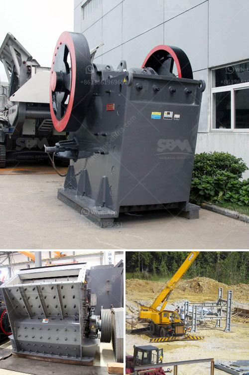

<h3>quote for jaw crusher</h3>
A jaw crusher is a machine that breaks down materials into smaller pieces using two jaw-shaped components. It is commonly used in mining, construction, and recycling industries. The jaw crusher is engineered for simplicity and ease of use. It features a unique vertical jaw alignment, which allows for optimum crushing performance. The crushing mechanism consists of two vertically oriented jaws, one fixed and the other moving. When the moving jaw moves back and forth, the material is crushed, resulting in a uniform and highly effective final product.

One of the main advantages of a jaw crusher is its ability to handle tough and abrasive materials. It can crush a wide range of materials, including concrete, stone, and asphalt, making it an ideal choice for heavy-duty construction and recycling applications. Furthermore, the jaw crusher is designed to be highly efficient, reducing energy consumption and operating costs.

In addition to its practicality and efficiency, a jaw crusher also offers versatility. It can be customized to meet specific requirements, such as the size and shape of the desired end product. This makes it suitable for a variety of applications, from primary crushing to secondary and tertiary crushing.

When considering a jaw crusher, it is important to look for a high-quality machine that can withstand heavy-duty use. Quote for jaw crushers can vary depending on the size and capacity required, as well as the features and options selected. However, it is essential to choose a reputable manufacturer known for producing durable and reliable equipment.

In conclusion, a jaw crusher is a valuable investment for any company in need of a reliable and efficient crushing solution. With its powerful capabilities and versatile design, a jaw crusher can handle a wide range of materials and applications. When searching for a quote, it is important to consider the specific requirements and desired features, as well as the reputation of the manufacturer.
<h3>Contact us</h3><ul><li><strong>Whatsapp:&nbsp;<a href="https://wa.me/8613661969651">+8613661969651</a></strong></li><li><a href="https://swt.shibang-china.com/?git&amp;zhl&amp;quote for jaw crusher"><strong>Online Service(chat now)</strong></a></li></ul><h3>Related</h3><ul><li><a href='ball mill working in hindi.md'>ball mill working in hindi</a></li><li><a href='copper ore crusher.md'>copper ore crusher</a></li><li><a href='conveyor belt manufacturers in pakistan.md'>conveyor belt manufacturers in pakistan</a></li><li><a href='mobile crushers manufactureres in china.md'>mobile crushers manufactureres in china</a></li><li><a href='bentonite production process.md'>bentonite production process</a></li></ul>