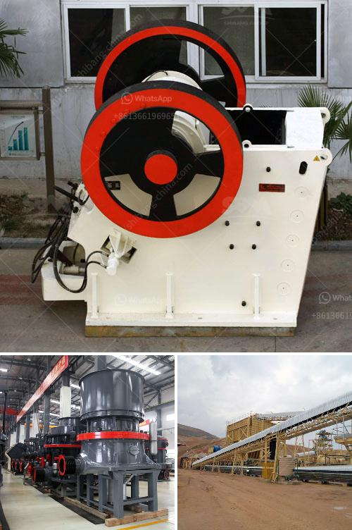

<h3>qustion about ball milling process</h3>
Ball milling is a mechanical process that aims to decrease the particle size of solid materials, such as minerals, ceramics, and metal powders. It involves the complete or partial transformation of larger particles into smaller ones, resulting in improved properties and performance of the material. However, there are several common questions that arise regarding the ball milling process. In this article, we will address a few of these questions.

One frequent question is, "What is the significance of ball size in the milling process?" The size of the grinding balls used in the ball mill impacts the energy transfer and grinding efficiency of the process. Smaller balls tend to provide more surface area for contact with the material, resulting in higher grinding rates. On the other hand, larger balls have more mass and are able to exert more force on the material, leading to faster particle size reduction. Therefore, the selection of ball size is crucial, and it depends on the desired particle size, milling time, and the material being milled.

Another common question is, "What is the optimal milling time for achieving the desired particle size?" Milling time is an important parameter that determines the extent of particle size reduction. Initially, the milling process is characterized by rapid reduction in particle size. However, as the milling time increases, the reduction rate slows down due to the occurrence of various factors such as agglomeration, contamination, and wear of the grinding media. Therefore, finding the optimal milling time is essential to avoid over-milling or under-milling. This can be achieved through experimental trials or by using models based on mathematical calculations.

One question that often arises is, "What is the impact of milling speed on the particle size?" The speed of the ball mill rotation is a critical factor that affects the agitation and energy transferred to the material. Higher speeds result in more violent impacts between the grinding media and the material, leading to faster particle size reduction. However, excessive speed can also lead to increased wear and damage to the grinding media and the mill itself. Therefore, the optimal milling speed needs to be determined for each specific material and desired particle size.

Lastly, a question that is often asked is, "What are the potential challenges associated with the ball milling process?" One major challenge is the contamination of the milled material by the grinding media and the mill itself. This can introduce impurities that affect the material's properties and performance. Therefore, proper selection of grinding media and the use of protective coatings or liners can help minimize contamination. Another challenge is the control of the milling process, as factors such as temperature, pressure, and humidity can influence the milling efficiency and final particle size. Comprehensive understanding of these challenges and implementing appropriate strategies is crucial for achieving desired milling outcomes.

In conclusion, ball milling is a versatile process that offers numerous benefits in terms of particle size reduction and material property enhancement. While there are several questions that arise regarding ball milling, such as ball size, milling time, milling speed, and associated challenges, understanding these aspects is crucial for successful implementation of the process. By addressing these questions and optimizing the ball milling parameters, researchers and engineers can harness the full potential of this mechanical milling technique.
<h3>Contact us</h3><ul><li><strong>Whatsapp:&nbsp;<a href="https://wa.me/8613661969651">+8613661969651</a></strong></li><li><a href="https://swt.shibang-china.com/?git&amp;zhl&amp;qustion about ball milling process"><strong>Online Service(chat now)</strong></a></li></ul><h3>Related</h3><ul><li><a href='small ball mill for sale.md'>small ball mill for sale</a></li><li><a href='kenya vibrating screen is manufactured.md'>kenya vibrating screen is manufactured</a></li><li><a href='gold washing machine for sale in tanzania.md'>gold washing machine for sale in tanzania</a></li><li><a href='price of a stone crusher.md'>price of a stone crusher</a></li><li><a href='manufacturer of industrial hammer mill.md'>manufacturer of industrial hammer mill</a></li></ul>