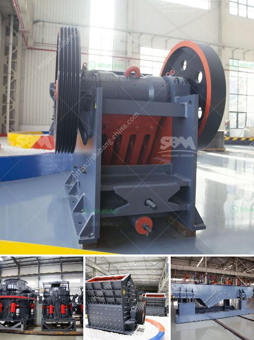

<h3>raymod 5 roller mill for pulverizing unit</h3>
The pulverizing unit is an essential component of any industry that requires the grinding and crushing of different materials. The Raymond 5 Roller Mill is one such pulverizing unit, offering an advanced grinding solution with an array of unmatched advantages.

Designed to pulverize variety of materials, the Raymond 5 Roller Mill ensures high productivity, reliability, and durability. With its unique design and cutting-edge technology, it has become a game-changer in multiple industries such as mining, construction, and chemicals.

First and foremost, the Raymond 5 Roller Mill stands out due to its exceptional grinding capacity. It can pulverize a wide range of materials, including limestone, feldspar, dolomite, kaolin, bentonite, and more. This versatility allows industries to process different minerals and raw materials efficiently, reducing the need for multiple machines.

The key element behind the impressive grinding efficiency of the Raymond 5 Roller Mill is its 5 rollers. These rollers rotate at different speeds, enabling the mill to deliver a consistent and fine grind. As a result, the pulverized material has a uniform particle size distribution, ensuring advanced quality control in various applications.

Another noteworthy feature of the Raymond 5 Roller Mill is its flexibility in controlling the fineness of the final product. This mill has an integrated dynamic classifier that optimizes the grinding process and guarantees precise particle size control. This feature allows industries to produce materials with specific and consistent particle sizes, meeting the exact requirements of their end-users.

The robust construction of the Raymond 5 Roller Mill is also worth mentioning. Its solid construction and heavy-duty components enhance the mill's durability, ensuring long service life. This durability translates into reduced maintenance costs, minimizing downtime and maximizing productivity for industries relying on the pulverizing process.

One of the key advantages of the Raymond 5 Roller Mill is its energy efficiency. The mill operates with low power consumption, reducing energy costs significantly. This aspect is particularly crucial in today's world, where sustainability and energy conservation are paramount concerns for industries.

Additionally, the Raymond 5 Roller Mill is equipped with advanced safety features to ensure the well-being of workers and the uninterrupted operation of the unit. These features include automatic lubrication systems, temperature monitoring, and high-pressure interlocking systems. These safety measures reduce the risk of accidents, providing a safe working environment.

In conclusion, the Raymond 5 Roller Mill is a technological marvel that offers numerous advantages for industries requiring a pulverizing unit. Its high grinding capacity, flexibility in controlling particle size, durability, energy efficiency, and safety features make it an exceptional choice. Whether it's mining, construction, or chemical industries, the Raymond 5 Roller Mill provides an efficient and cost-effective solution for pulverizing material, ultimately improving overall productivity and quality for industrial processes.
<h3>Contact us</h3><ul><li><strong>Whatsapp:&nbsp;<a href="https://wa.me/8613661969651">+8613661969651</a></strong></li><li><a href="https://swt.shibang-china.com/?git&amp;zhl&amp;raymod 5 roller mill for pulverizing unit"><strong>Online Service(chat now)</strong></a></li></ul><h3>Related</h3><ul><li><a href='quartz powder plant nigeria.md'>quartz powder plant nigeria</a></li><li><a href='copper ore processing plant kenya.md'>copper ore processing plant kenya</a></li><li><a href='coal grinding mill in bhopal india.md'>coal grinding mill in bhopal india</a></li><li><a href='stone crusher machine in saudi arabia.md'>stone crusher machine in saudi arabia</a></li><li><a href='stone crusher manufacturers in ludhiana.md'>stone crusher manufacturers in ludhiana</a></li></ul>