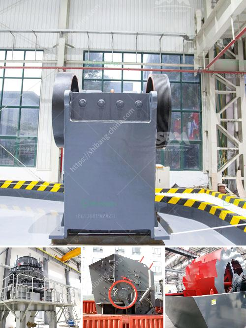

<h3>raymond grinding mill for sale in thailand</h3>
Thailand is rich in various types of minerals and the mining industry plays a vital role in stimulating the country's economy. The development of mining resources requires high-performance equipment such as grinding mills, which are used to grind a variety of minerals and achieve finer particle sizes. 

Raymond grinding mill is a popular choice for mineral processing due to its simplicity and low capital investment. Compared to other grinding mills, Raymond mill has a higher efficiency and low energy consumption. Raymond mill grinds minerals by the principle of impact and grinding between the grinding roller and ring. The grinding roller rotates freely, and the material is ground by the action of the roller and the grinding ring. 

One of the key advantages of Raymond mill is its ability to dry-grind diverse types of minerals with minimal moisture content. This grinding mill is suitable for grinding non-flammable and non-explosive materials with hardness below 7 and humidity less than 6%, such as limestone, gypsum, barite, feldspar, talc, calcite, clay, activated carbon, bentonite, kaolin, cement, phosphate rock, etc. 

In addition, Raymond grinding mill is suitable for the grinding and processing of more than 280 kinds of non-flammable and non-explosive materials with hardness less than 9.3 and humidity less than 6%. The fineness of the finished product can be adjusted within the range of 80-600 mesh, and some materials can even be produced up to 1000 mesh. 

The demand for high-quality mineral products is constantly increasing, and Raymond grinding mill meets this demand with its excellent performance and efficient operation. Manufacturers in Thailand are offering Raymond grinding mills for sale, to improve the mining industry's productivity.

In conclusion, Raymond grinding mill is a highly versatile milling equipment widely used in the mining industry. Its advantages include high fineness, low energy consumption, and a wide range of applications. With the increasing demand for high-quality mineral products, manufacturers in Thailand are providing Raymond grinding mills for sale to meet the mining industry's needs.
<h3>Contact us</h3><ul><li><strong>Whatsapp:&nbsp;<a href="https://wa.me/8613661969651">+8613661969651</a></strong></li><li><a href="https://swt.shibang-china.com/?git&amp;zhl&amp;raymond grinding mill for sale in thailand"><strong>Online Service(chat now)</strong></a></li></ul><h3>Related</h3><ul><li><a href='granite rock breaking machine manufacturer in mlaysia.md'>granite rock breaking machine manufacturer in mlaysia</a></li><li><a href='prices of aggregate crusher plants.md'>prices of aggregate crusher plants</a></li><li><a href='coal mill grinding rolls.md'>coal mill grinding rolls</a></li><li><a href='jaw crusher for sale in ethiopia.md'>jaw crusher for sale in ethiopia</a></li><li><a href='fine grinding ball mills.md'>fine grinding ball mills</a></li></ul>