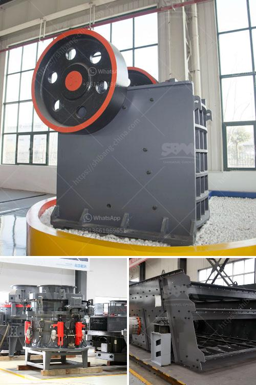

<h3>raymond grinding mill machine</h3>
Raymond Grinding mill machine, also known as Raymond mill, is widely used in various industries, including mining, chemical, construction, and metallurgy. Raymond mill is suitable for grinding of all kinds of materials whose Moh’s hardness is below 9.3, such as calcium carbonate, barite, dolomite, calcite, limestone, kaolin, bentonite, marble, gypsum, quartz, feldspar, clay, talc, fluorite, clay, white mud, mica, refractory material, glass, total about 1000 kinds of materials. 

With the continuous development of Raymond mill, the structure of Raymond mill has been improved day by day. The optimized design of the various components makes the operation and maintenance of Raymond mill more convenient and efficient. Raymond mill is equipped with a small appearance, and good stability, which is widely used in small and medium-sized mines, chemical industry, building materials, metallurgy, refractories, pharmaceuticals, cement and other industries.

The main transmission device adopts a sealed gear box and pulley, and the transmission is stable and reliable. The important parts of Raymond mill are made of high-quality steel, and the wear parts are made of high-performance wear-resistant materials. The whole machine has high wear resistance and reliable operation. The electrical system of Raymond mill adopts centralized control, and the working process can be unattended, which can basically realize unmanned operation. The dust-removing device can effectively achieve the required environmental protection effect, and the energy saving effect is remarkable compared with similar powder equipment.

In summary, Raymond mill is a high-efficient equipment satisfactory to solve the problems of low capacity, high consumption, short service life, high maintenance cost and other shortcomings. It has the features of high grinding efficiency, low power consumption, large feed size, easy adjustment of product fineness, simple process flow, small floor area, low noise, low dust generation, etc. Raymond mill is an ideal grinding equipment for non-metallic mineral processing.
<h3>Contact us</h3><ul><li><strong>Whatsapp:&nbsp;<a href="https://wa.me/8613661969651">+8613661969651</a></strong></li><li><a href="https://swt.shibang-china.com/?git&amp;zhl&amp;raymond grinding mill machine"><strong>Online Service(chat now)</strong></a></li></ul><h3>Related</h3><ul><li><a href='ball mills for open pit mine.md'>ball mills for open pit mine</a></li><li><a href='jaw crushing plant cost.md'>jaw crushing plant cost</a></li><li><a href='mobile crusher company.md'>mobile crusher company</a></li><li><a href='bentonite grinding project.md'>bentonite grinding project</a></li><li><a href='complete rock crusher machine prices in pakistan.md'>complete rock crusher machine prices in pakistan</a></li></ul>