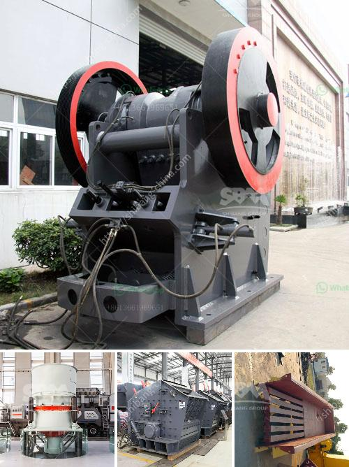

<h3>raymond mill manufacturers in india</h3>
Raymond mill is a common grinding equipment used to grind barite, calcite, potash feldspar, talcum, marble, limestone, ceram and slag below scale 7 of moth's hardness and 6% humidity non flammable and non-explosive materials. Its fine powder fineness can be adjusted between 80-800 mesh, which makes it suitable for high-fine powder processing equipment. Raymond mill is also called Raymond roller mill or Raymond grinding mill.

Due to the popularity of Raymond mill, the market demand for Raymond mill manufacturers in India is increasing. Clirik Machinery is one of the most professional Raymond mill manufacturers in India. It has a history of more than 20 years. In the past 20 years, Clirik Machinery has been focusing on the research and development and manufacturing of mining machinery, mainly producing Raymond mill, ball mill, crusher and various accessories.

Undoubtedly, Clirik Machinery is one of the most professional Raymond mill manufacturers in India. The main products include Raymond mill, Raymond roller mill and so on. In addition, Clirik Machinery can also provide customers with customized solutions to meet various needs. From the selection of equipment to the installation and commissioning of the entire production line, Clirik Machinery can provide one-stop service.

What makes Clirik Machinery unique among Raymond mill manufacturers in India is that it can not only produce the standard Raymond mill, but also produce a series of other types of grinding equipment, such as high-pressure suspension roller mill, ultra-fine mill and vertical roller mill. These equipment are widely used in various fields, such as mining, construction, chemical industry, metallurgy, refractory materials, environmental protection and so on.

In addition to the high-quality equipment, Clirik Machinery also provides comprehensive and thoughtful after-sales service. When customers purchase Raymond mill or other grinding equipment, Clirik Machinery will arrange professional technicians to guide the installation and commissioning of the equipment, and provide operation training for the operators. In case of any problems during operation, Clirik Machinery will solve them in time.

Moreover, as one of the most professional Raymond mill manufacturers in India, Clirik Machinery has established a good cooperative relationship with many local mining enterprises. Clirik Machinery's equipment has been widely praised and recognized by customers, and has won a good reputation in the mining machinery industry.

In summary, with its excellent products, customized solutions and comprehensive after-sales service, Clirik Machinery has become one of the most professional and reliable Raymond mill manufacturers in India. It will continue to provide customers with high-quality grinding equipment and services, and strive to contribute to the development of India's mining industry.
<h3>Contact us</h3><ul><li><strong>Whatsapp:&nbsp;<a href="https://wa.me/8613661969651">+8613661969651</a></strong></li><li><a href="https://swt.shibang-china.com/?git&amp;zhl&amp;raymond mill manufacturers in india"><strong>Online Service(chat now)</strong></a></li></ul><h3>Related</h3><ul><li><a href='hammer pulverizer machine.md'>hammer pulverizer machine</a></li><li><a href='coal crushing and screening plant.md'>coal crushing and screening plant</a></li><li><a href='ultrafine powder mill.md'>ultrafine powder mill</a></li><li><a href='calcite grinding process.md'>calcite grinding process</a></li><li><a href='flowsheet for crushing plant.md'>flowsheet for crushing plant</a></li></ul>