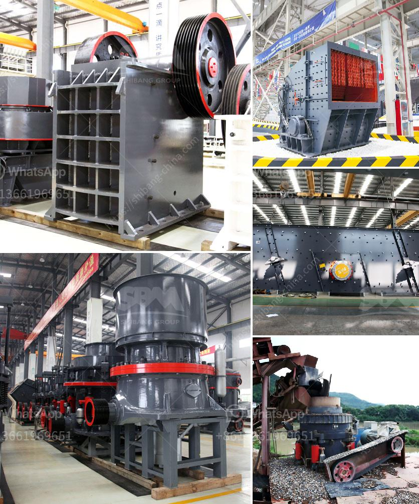

<h3>raymond mills india</h3>
In recent years, India has emerged as one of the fastest-growing economies in the world. With a burgeoning middle class and a population of over 1.3 billion, the country has become an attractive destination for international investors across various sectors. One industry that has witnessed significant growth is the textile and apparel sector, with Raymond Mills India playing a crucial role in its development and success.

Raymond Mills India, a part of the Raymond Group, operates as a major player in the Indian textile and garment industry. Established in 1925, the company is headquartered in Mumbai and has manufacturing units located in various parts of the country. Over the years, Raymond Mills has transformed itself from a small textile mill into one of India's leading fashion and lifestyle brands.

One of the key factors contributing to Raymond Mills India's success is its focus on understanding and catering to the diverse demographics of the country. India is known for its cultural and regional diversity, and Raymond Mills has capitalized on this by offering a wide range of products to suit different tastes and preferences. From formal wear to casual clothing, the company has created a niche for itself in the Indian market by offering high-quality products that resonate with the local consumers.

Furthermore, Raymond Mills India has been quick to adapt to changing consumer trends and preferences. With the rise of e-commerce and the increasing popularity of online shopping, the company has invested heavily in its online presence. Today, customers can easily browse and purchase Raymond Mills products through the company's website or various e-commerce platforms. This has not only expanded the brand's reach but also allowed it to tap into the growing online retail market in India.

In addition to catering to the domestic market, Raymond Mills India has also been actively expanding its international presence. The company exports its products to several countries, including the United States, Europe, and the Middle East. This global outreach has not only boosted Raymond Mills' revenue but has also helped to establish India as a hub for high-quality textile and garment manufacturing.

However, Raymond Mills India's success does not come without its challenges. The textile and apparel industry is highly competitive, both domestically and internationally. With the influx of international brands and the growing demand for fast fashion, Raymond Mills faces the constant pressure to innovate and stay ahead of the curve. The company has responded to this challenge by investing in research and development and continuously introducing new collections and designs to captivate the market.

Moreover, Raymond Mills India is also committed to sustainability and social responsibility. The company has implemented several initiatives to reduce its carbon footprint and promote ethical practices throughout its supply chain. This approach has not only garnered support from environmentally conscious consumers but has also helped to enhance the brand's reputation in the global market.

Overall, Raymond Mills India has established itself as a prominent player in the Indian textile and apparel industry. With its focus on understanding and catering to the diverse demographics of the country, the company has carved a niche for itself in the market. By continuously adapting to changing consumer trends and investing in innovation, Raymond Mills India is well-positioned for further growth and success in the years to come.
<h3>Contact us</h3><ul><li><strong>Whatsapp:&nbsp;<a href="https://wa.me/8613661969651">+8613661969651</a></strong></li><li><a href="https://swt.shibang-china.com/?git&amp;zhl&amp;raymond mills india"><strong>Online Service(chat now)</strong></a></li></ul><h3>Related</h3><ul><li><a href='clay crusher price.md'>clay crusher price</a></li><li><a href='cement plant machinery list.md'>cement plant machinery list</a></li><li><a href='ball mill working in hindi.md'>ball mill working in hindi</a></li><li><a href='silica sand washing and grinding.md'>silica sand washing and grinding</a></li><li><a href='complete scm stone crushing plant 4tph.md'>complete scm stone crushing plant 4tph</a></li></ul>