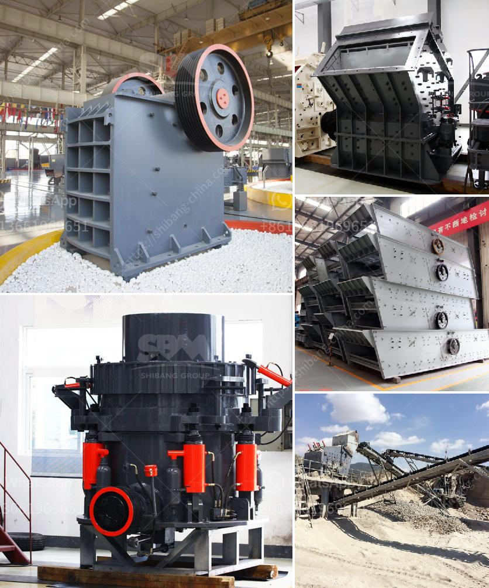

<h3>raymond mills mexico</h3>
Mexico, known for its rich heritage and vibrant culture, has emerged as a key player in the global manufacturing industry. From automobiles to electronics, the country has attracted several multinational companies seeking to benefit from its strategic location, skilled workforce, and favorable business environment. One company that has significantly contributed to Mexico's manufacturing sector is Raymond Mills.

Raymond Mills, an American machinery manufacturer, started its journey in 1922 when it first opened its doors in Chicago, Illinois. Primarily focused on the production of heavy machinery and equipment, Raymond Mills soon gained recognition for its quality products and excellent customer service. This reputation allowed the company to expand its operations globally, including Mexico.

Mexico's competitive advantages, such as its proximity to the United States and a large pool of skilled labor, compelled Raymond Mills to establish a manufacturing facility in the country. With its expansion into Mexico, the company not only strengthened its presence but also brought numerous benefits to the local economy.

The Raymond Mills facility in Mexico enabled the company to seamlessly cater to the growing demand for its products in the region. By manufacturing locally, they were able to reduce production costs while maintaining high-quality standards. This, in turn, made their products more affordable and accessible to both domestic and international customers. Moreover, their strategic location allowed for efficient logistics and timely delivery to customers across North America.

One key aspect of Raymond Mills' success in Mexico is its commitment to workforce development. The company has invested heavily in training programs for its employees, ensuring they possess the necessary skills and expertise to operate and maintain their advanced machinery. This has not only increased the productivity of their Mexican operations but has also created numerous job opportunities for the local population.

Additionally, Raymond Mills' presence in Mexico has also resulted in technology transfer and knowledge sharing. The company has collaborated with local universities and research institutions, sharing their expertise and collaborating on innovative projects. This collaboration has not only advanced Mexico's manufacturing capabilities but has also further solidified its position as a hub for technological innovation in the region.

Another notable impact of Raymond Mills' operations in Mexico is its contribution to sustainability. The company has implemented various initiatives to reduce its environmental footprint, such as investing in energy-efficient equipment, optimizing production processes, and implementing recycling programs. These efforts have not only helped the company in achieving its sustainability goals but have also inspired other manufacturers in Mexico to follow suit.

In conclusion, Raymond Mills' expansion into Mexico has revolutionized the country's manufacturing industry. By establishing a state-of-the-art manufacturing facility, the company has not only strengthened its presence in the region but has also brought significant economic, social, and environmental benefits. Through its commitment to producing high-quality products, investing in employee training, and promoting sustainable practices, Raymond Mills continues to make a positive impact on Mexico's manufacturing sector and contribute to its overall economic development.
<h3>Contact us</h3><ul><li><strong>Whatsapp:&nbsp;<a href="https://wa.me/8613661969651">+8613661969651</a></strong></li><li><a href="https://swt.shibang-china.com/?git&amp;zhl&amp;raymond mills mexico"><strong>Online Service(chat now)</strong></a></li></ul><h3>Related</h3><ul><li><a href='controlling parameter of impact crusher.md'>controlling parameter of impact crusher</a></li><li><a href='proposal pabrik stone crusher.md'>proposal pabrik stone crusher</a></li><li><a href='slag grinderr capling.md'>slag grinderr capling</a></li><li><a href='bauxite manufacture equipment in india.md'>bauxite manufacture equipment in india</a></li><li><a href='price of smallest chippings crusher plant.md'>price of smallest chippings crusher plant</a></li></ul>