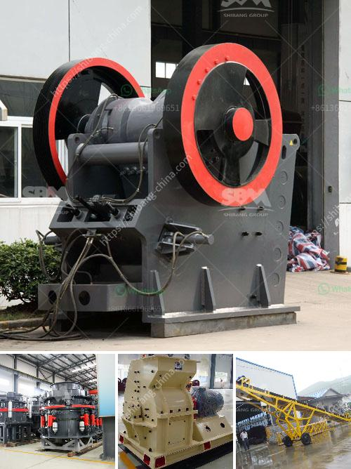

<h3>raymond mills mumbai</h3>
When it comes to fashion, there are few brands in India that can rival the legacy and influence of Raymond Mills. Founded in 1925, Raymond Mills has been a prominent player in the Indian fashion industry for decades. Headquartered in Mumbai, the brand is known for its high-quality fabrics, exquisite tailoring, and impeccable craftsmanship.

One of the key factors that set Raymond Mills apart from its competitors is its focus on the complete fashion experience. From classic formal wear to trendy casuals, the brand offers a wide range of apparel options for men and women. Whether you are looking for a sharp suit for a corporate event or a stylish outfit for a casual weekend outing, Raymond Mills has got you covered.

One of the brand's most iconic offerings is its range of premium suiting fabrics. Known for their luxurious feel and impeccable drape, Raymond Mills' fabrics have become synonymous with quality and craftsmanship. The brand's suiting fabrics are carefully crafted using the finest wool and blended with other natural fibers for enhanced comfort and durability. With their wide range of colors, patterns, and textures, Raymond Mills' suiting fabrics allow individuals to express their personal style and make a lasting impression.

Another area where Raymond Mills excels is custom tailoring. The brand understands that a perfect fit can elevate a garment from good to great. With their team of skilled master tailors, Raymond Mills offers impeccable custom tailoring services, ensuring that each garment is tailored to perfection. From the choice of fabric to the smallest details like buttons and stitching, every aspect of a garment is carefully considered to ensure a flawless fit and finish.

In addition to their exceptional clothing options, Raymond Mills also offers a range of accessories and grooming products. From stylish leather belts and wallets to elegant cufflinks and ties, the brand's accessories are designed to complement their clothing collection and add a touch of sophistication to any ensemble. Furthermore, Raymond Mills' grooming products, including fragrances and skincare essentials, allow individuals to complete their fashion statement with confidence.

Over the years, Raymond Mills has earned a loyal customer base not only in India but also internationally. The brand's commitment to quality, attention to detail, and constant innovation have made it the go-to choice for discerning individuals who value style and refinement. Moreover, Raymond Mills' wide network of retail stores and presence in leading e-commerce platforms make their products easily accessible to customers across the country.

In conclusion, Raymond Mills Mumbai is a brand that has truly carved a niche for itself in the Indian fashion industry. With its rich heritage, commitment to quality, and extensive range of clothing and accessories, the brand continues to define the fashion landscape in India. From the office boardroom to the social soirée, Raymond Mills offers individuals the opportunity to dress their best and make a lasting impression. With Raymond Mills, fashion excellence is just a wardrobe away.
<h3>Contact us</h3><ul><li><strong>Whatsapp:&nbsp;<a href="https://wa.me/8613661969651">+8613661969651</a></strong></li><li><a href="https://swt.shibang-china.com/?git&amp;zhl&amp;raymond mills mumbai"><strong>Online Service(chat now)</strong></a></li></ul><h3>Related</h3><ul><li><a href='mobile crushers manufactureres in china.md'>mobile crushers manufactureres in china</a></li><li><a href='mobile crusher prices in philippines.md'>mobile crusher prices in philippines</a></li><li><a href='cost of cement manufacturing machine china.md'>cost of cement manufacturing machine china</a></li><li><a href='basic process in producing clay products.md'>basic process in producing clay products</a></li><li><a href='crushing plants for sale in south africa.md'>crushing plants for sale in south africa</a></li></ul>