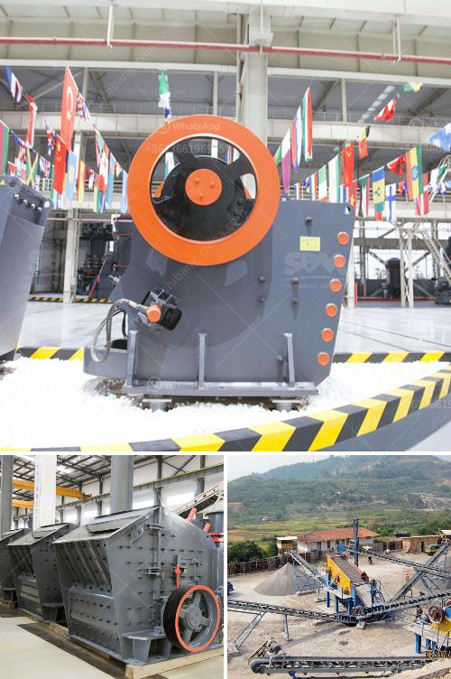

<h3>raymond roller mills in kolkata</h3>
In the industrial sector, Raymond Roller Mills have been an integral part of the manufacturing process for more than a century. Since the inception of the mills in the late 19th century, these mills have been designed and manufactured to meet the demands of the market, providing reliable and efficient grinding solutions.

Kolkata, a major industrial hub in India, has witnessed the presence of Raymond Roller Mills since the early days of its industrialization. Over the years, these mills have played a crucial role in numerous industries, including mining, construction, and chemical manufacturing.

One of the key reasons behind the enduring success of Raymond Roller Mills is their ability to consistently deliver high-quality and finely pulverized materials. The mills utilize a unique grinding motion that creates a centrifugal force, which ensures the material is evenly and efficiently ground. This mechanism allows for precise and uniform particle size distribution, making Raymond Roller Mills a preferred choice for manufacturers across various sectors.

Another aspect that sets Raymond Roller Mills apart is their versatility. These mills are designed to handle a wide range of materials, from soft and medium-hard minerals to abrasive and even sticky materials. This adaptability makes them ideal for grinding minerals, such as limestone, gypsum, baryte, and talc, as well as industrial minerals like kaolin, bentonite, and clay. Additionally, Raymond Roller Mills are also used in the processing of chemical raw materials, such as activated carbon, carbon black, and pigments, to name a few.

The reliability and durability of Raymond Roller Mills are attributes that have stood the test of time. Kolkata, being a thriving industrial hub, demands equipment that can withstand rigorous production cycles and deliver consistent performance. Raymond Roller Mills fulfill these requirements with their robust construction and high-quality components. The mills are designed to withstand heavy loads and feature a high resistance to wear and tear, ensuring a long lifespan and minimal maintenance.

Moreover, with the evolving needs of the industry, Raymond Roller Mills have continuously evolved and improved. The introduction of advanced technologies has enhanced their efficiency and reduced energy consumption, making them even more cost-effective and environmentally friendly.

In conclusion, Raymond Roller Mills have established themselves as a standard in the industry, providing reliable and efficient grinding solutions for over a century. Their presence in Kolkata's industrial landscape highlights their versatility and ability to meet the demands of various sectors. As the industry continues to evolve, Raymond Roller Mills will undoubtedly play a pivotal role in shaping the manufacturing processes of the future.
<h3>Contact us</h3><ul><li><strong>Whatsapp:&nbsp;<a href="https://wa.me/8613661969651">+8613661969651</a></strong></li><li><a href="https://swt.shibang-china.com/?git&amp;zhl&amp;raymond roller mills in kolkata"><strong>Online Service(chat now)</strong></a></li></ul><h3>Related</h3><ul><li><a href='coal crusher capacity price.md'>coal crusher capacity price</a></li><li><a href='mini ball mill crusher.md'>mini ball mill crusher</a></li><li><a href='two pass roller mill.md'>two pass roller mill</a></li><li><a href='sand making machine application.md'>sand making machine application</a></li><li><a href='shaft hammer crusher hds.md'>shaft hammer crusher hds</a></li></ul>