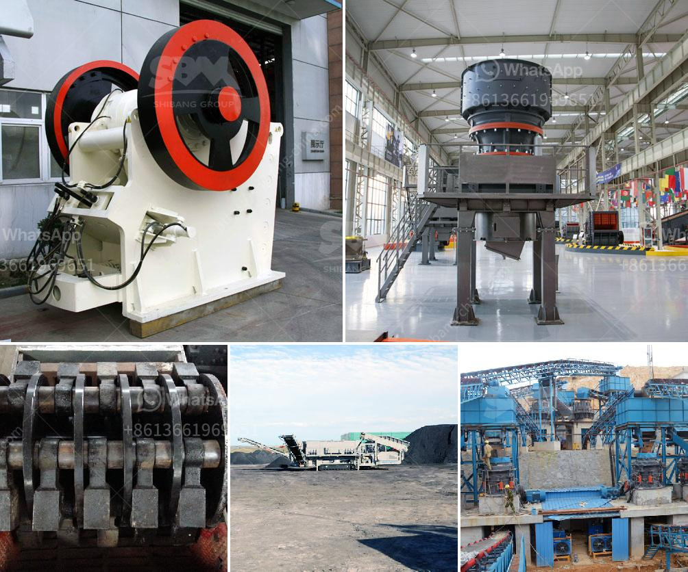

<h3>recycling machines for sale in south africa</h3>
Recycling is a crucial component of promoting sustainability and reducing waste accumulation. It helps conserve natural resources, reduces greenhouse gas emissions, and creates job opportunities. Governments and organizations globally are making conscious efforts to increase recycling rates, and South Africa is no exception. To support this growing movement, a range of recycling machines are readily available for sale in South Africa.

One of the most common types of recycling machines found in the market is the plastic recycling machine. South Africa, unfortunately, faces substantial plastic waste challenges, with millions of tons of plastic waste being generated every year. Plastic recycling machines help address this by transforming discarded plastic materials into valuable products. These machines can process various types of plastic waste, including bottles, packaging materials, and automotive plastics, to produce products like plastic pellets or granules for manufacturing operations.

Another significant segment of recycling machines widely available in South Africa is for paper and cardboard recycling. As the demand for paper and cardboard products continues to rise, paper recycling machines come into play, facilitating the recycling process. These machines typically involve shredding the waste paper and cardboard materials, which are then used to produce new paper products or even packaging materials.

Furthermore, metal recycling machines are also crucial in South Africa, given the country's mining industry and large scrap metal market. These machines can process a wide range of metal materials, including aluminum, copper, steel, and more, to create new products. By recycling metal waste, the country can reduce the need for costly and environmentally damaging mining operations while conserving natural resources.

When considering the purchase of a recycling machine in South Africa, there are a few factors to take into account. Firstly, the capacity of the machine should align with the intended recycling volume. Different machines have varying capacities, and it is essential to choose one that can handle the expected waste stream. Secondly, the cost of the machine is an important consideration, as it should fit within the budget constraints of the buyer. Additionally, factors such as the machine's energy efficiency, maintenance requirements, and after-sales support should also be evaluated.

In recent years, the South African government has taken significant steps to promote recycling and waste management practices. Alongside this, various private companies and entrepreneurs have recognized the importance of recycling machines and are offering them for sale across South Africa. These machines not only provide a means to address the persistent waste management challenges but also offer an opportunity for businesses to participate in the circular economy and contribute to a sustainable future.

To conclude, recycling machines play a crucial role in addressing South Africa's waste management challenges and promoting sustainability. The availability of plastic recycling machines, paper and cardboard recycling machines, and metal recycling machines offers individuals and businesses the opportunity to transform waste into valuable resources. By investing in these machines, South Africa moves closer to achieving its recycling goals, conserving natural resources, and creating a cleaner, greener future for all.
<h3>Contact us</h3><ul><li><strong>Whatsapp:&nbsp;<a href="https://wa.me/8613661969651">+8613661969651</a></strong></li><li><a href="https://swt.shibang-china.com/?git&amp;zhl&amp;recycling machines for sale in south africa"><strong>Online Service(chat now)</strong></a></li></ul><h3>Related</h3><ul><li><a href='business plan on manganese ore mining.md'>business plan on manganese ore mining</a></li><li><a href='cement plant process flow diagram ppt.md'>cement plant process flow diagram ppt</a></li><li><a href='kaolin manufacturing process.md'>kaolin manufacturing process</a></li><li><a href='stone crusher machine dealer in uae.md'>stone crusher machine dealer in uae</a></li><li><a href='california rock crusher machine.md'>california rock crusher machine</a></li></ul>